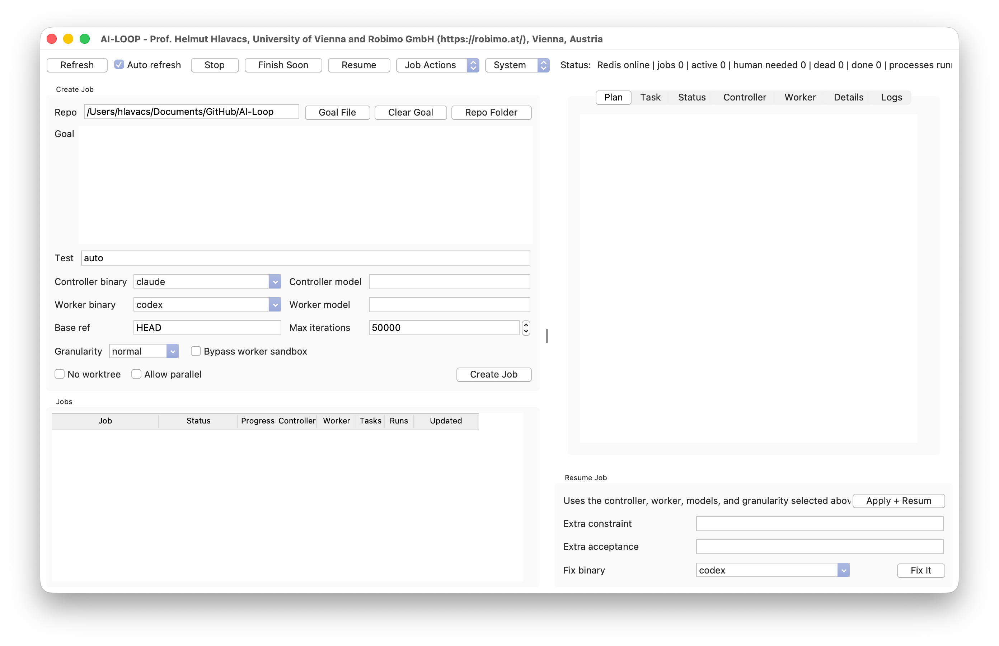

# AI-Loop

Coding agents work well on focused changes. Larger jobs are harder. They may span many files and need several rounds of implementation, testing, and review. A chat session can run out of context or stop at a usage limit before the repository is ready.

AI-Loop runs this work as a persistent job. You provide a repository and a goal. A controller creates tasks and reviews the results. A worker edits the code and runs the validation command. The job continues until the goal is complete, it needs your input, or you stop it.

## Typical uses

AI-Loop is useful for work that is too large for one prompt:

- Build a feature that touches several files, tests, and documentation.
- Refactor or migrate a codebase while checking that behavior stays correct.
- Diagnose and repair a failing build or test suite.
- Add test coverage and fix the problems exposed by those tests.
- Run a long development task unattended, then inspect or resume it later.
- Use different models for review and implementation. For example, Claude can control the job while Codex performs the edits.

AI-Loop works best when the goal is clear and the result can be checked with a command. Product decisions, credentials, destructive operations, and unclear requirements still need human attention.

## Why keep the job state?

AI-Loop stores the plan, tasks, model decisions, run results, progress, and final state. If a process crashes or a model reaches a usage limit, the job can wait and continue later. The GUI lets you inspect the work, change models or task size, stop early, and resume when you are ready.

Jobs normally run in isolated Git worktrees, so the original checkout stays separate from work in progress. Codex, Claude, and Gemini-compatible CLIs can each act as controller or worker. SQLite stores the job state. Redis Streams coordinate the processes. The Tkinter GUI shows what is happening.

## What you get

- Durable jobs, tasks, runs, decisions, events, plans, estimates, and terminal state in SQLite.
- One controller, worker, and watcher process per active job.
- An immutable, enumerated overall plan created with every job.
- Fine, normal, and coarse task granularity.
- Automatic retry after a model token limit: the reset time is extracted, the job shows `waiting_tokens`, and execution resumes one minute after replenishment.
- Status email every 12 hours for long-running jobs, plus a notification when a job finishes or needs attention.
- Live GUI status, changed-only text refresh, wrapped text, informative hover help, logs, task/run history, and work/time estimates.
- `Finish Soon` to reduce remaining work without lowering acceptance quality, and `Finish Early` to stop immediately while preserving progress.
- Safe promotion of successful worktree changes back to the original checkout when paths do not conflict.

## Requirements

Required:

- Python 3.10 or newer
- Git
- Redis server
- `redis-py`
- At least one supported controller CLI and one supported worker CLI

Required for the GUI:

- Tkinter

Optional:

- A local `sendmail` command or an SMTP account for email
- Bash for the convenience launchers

Supported role choices are `claude`, `codex`, `fable`, `opus`, and `gemini` for workers and controllers. `fable` and `opus` remain available as Claude CLI aliases with separate legacy model settings. The GUI uses simpler binary and model controls.

### Linux installation

Package names vary by distribution. On Debian or Ubuntu, the base dependencies are typically:

```bash
sudo apt update
sudo apt install python3 python3-venv python3-tk git redis-server
```

Create an environment and install the Python dependency:

```bash
cd /path/to/ai-loop
python3 -m venv .venv
source .venv/bin/activate
python -m pip install --upgrade pip redis
```

Install and authenticate the controller/worker CLIs you intend to select, then verify them, for example:

```bash
codex --version
claude --version
gemini --version
```

### macOS installation

Install Python, Git, and Redis with your preferred package manager, then create the same `.venv` shown above. The GUI includes a separate macOS hibernation helper. Changing hibernation mode invokes `sudo pmset` only after confirmation.

### Windows installation

Install Python with Tkinter, Git, and Redis or a Redis-compatible service. Run the Python entry points directly from PowerShell. The Bash wrappers require WSL, Git Bash, or another Bash environment.

### Verify the installation

```bash
python3 -c "import redis, tkinter"
git --version
redis-cli ping
python3 -m py_compile controller.py worker.py start_job.py resume_job.py ai_loop_gui.py ai_loop/*.py
```

`redis-cli ping` should print `PONG`. If Redis is not already running, start it with your operating system service manager or:

```bash
redis-server --save "" --appendonly no
```

## Configuration

All settings are optional unless your environment needs an override.

| Variable | Purpose | Default |
| --- | --- | --- |
| `AI_LOOP_DB` | SQLite database path | `./ai_loop.sqlite3` |
| `AI_LOOP_RUNS_DIR` | Generated job worktrees | sibling `ai-runs/` directory |
| `REDIS_URL` | Redis connection | `redis://localhost:6379/0` |
| `AI_LOOP_CONTROLLER` | New-job controller | `opus` |
| `AI_LOOP_WORKER` | New-job worker | `codex` |
| `AI_LOOP_GRANULARITY` | New-job task size | `normal` |
| `AI_LOOP_TEST_CMD` | Explicit validation command | inferred from repository |
| `CODEX_BIN`, `CLAUDE_BIN`, `GEMINI_BIN` | CLI executable paths | CLI name on `PATH` |
| `AI_LOOP_CODEX_MODEL` | Optional Codex model override | CLI default |
| `AI_LOOP_FABLE_MODEL` | Optional Fable override | CLI default |
| `AI_LOOP_OPUS_MODEL` | Optional Opus override | CLI default |
| `AI_LOOP_GEMINI_MODEL` | Optional Gemini override | CLI default |
| `AI_LOOP_CONTROLLER_MODEL` | Optional default-Claude controller override | CLI default |
| `AI_LOOP_CONTROLLER_ROLE_MODEL` | Model selected specifically for the controller process | provider model above |
| `AI_LOOP_WORKER_ROLE_MODEL` | Model selected specifically for the worker process | provider model above |
| `CODEX_BYPASS_SANDBOX` | Allow unrestricted worker execution | false in Python entry points |
| `AI_LOOP_NOTIFY_EMAIL` | Status and terminal notification recipient | empty |
| `AI_LOOP_SMTP_HOST` | SMTP server. Empty uses local `sendmail` | empty |
| `AI_LOOP_SMTP_PORT` | SMTP port | 587, or 465 with SSL |
| `AI_LOOP_SMTP_USER`, `AI_LOOP_SMTP_PASSWORD` | SMTP authentication | empty |
| `AI_LOOP_SMTP_FROM` | Sender address | SMTP user or recipient |
| `AI_LOOP_SMTP_STARTTLS` | Upgrade SMTP connection with STARTTLS | true |
| `AI_LOOP_SMTP_SSL` | Use SMTP-over-SSL | false |

### Private email launcher

The easiest way to keep the mail settings out of the repository is to place a launcher beside the `AI-Loop` folder. Name it `start-ai-loop-with-email.bash`. Replace the example values with your own SMTP settings. Do not put the password in the file.

```bash
#!/usr/bin/env bash

set -euo pipefail

AI_LOOP_NOTIFY_EMAIL="recipient@example.edu"
AI_LOOP_SMTP_HOST="mail.example.edu"
AI_LOOP_SMTP_PORT="465"
AI_LOOP_SMTP_USER="account-id"
AI_LOOP_SMTP_FROM="sender@example.edu"
AI_LOOP_SMTP_SSL="1"
AI_LOOP_SMTP_STARTTLS="0"

read -r -s -p "SMTP password: " AI_LOOP_SMTP_PASSWORD
printf "\n"

: "${AI_LOOP_SMTP_PASSWORD:?SMTP password is required}"

export AI_LOOP_NOTIFY_EMAIL
export AI_LOOP_SMTP_HOST
export AI_LOOP_SMTP_PORT
export AI_LOOP_SMTP_USER
export AI_LOOP_SMTP_PASSWORD
export AI_LOOP_SMTP_FROM
export AI_LOOP_SMTP_STARTTLS
export AI_LOOP_SMTP_SSL

launcher_dir="$(cd -- "$(dirname -- "${BASH_SOURCE[0]}")" && pwd)"
repo_dir="$launcher_dir/AI-Loop"

if [[ ! -x "$repo_dir/ai_gui.bash" ]]
then
    echo "AI-Loop launcher not found at $repo_dir/ai_gui.bash" >&2
    exit 1
fi

cd "$repo_dir"
exec ./ai_gui.bash "$@"
```

Make the launcher private and executable:

```bash
chmod 700 ../start-ai-loop-with-email.bash
```

Run it from the repository:

```bash
../start-ai-loop-with-email.bash
```

The launcher asks only for the password. The input is hidden and exported only to the AI-Loop processes started by that script. The password is not written to the launcher or the job database. Keep the launcher outside the repository so its fixed account settings are not committed. Notification delivery failures are recorded as events and do not erase a successful job result.

> **SMTP port remark:** The example uses implicit SSL on port `465`. If your provider uses STARTTLS, port `587` is the common choice. Set `AI_LOOP_SMTP_PORT="587"`, `AI_LOOP_SMTP_SSL="0"`, and `AI_LOOP_SMTP_STARTTLS="1"`. Use the values published by your email provider if they differ.

For an active job, the watcher sends a progress email after 12 hours and then once every 12 hours until the job reaches a terminal state. The email includes the current status, progress estimate, remaining-time estimate, controller, worker, task and run counts, current task, and latest controller summary. The last attempt is stored in SQLite, so restarting the watcher does not restart the 12-hour interval.

## Graphical user interface

### Start the GUI

```bash
python3 ai_loop_gui.py
```

or:

```bash
./ai_gui.bash --theme default
./ai_gui.bash --list-themes
```

The Bash launcher checks Python, Tkinter, Git, and `redis-server`. When one is
missing, it attempts installation with Homebrew, `apt-get`, `dnf`, or `pacman`.
If installation fails, startup prints the underlying error and the usual manual
install command. If the selected Python lacks `redis-py`, the GUI creates
`.gui-venv`, installs `redis`, and restarts itself.

When a job is created, the GUI also checks its selected Codex, Claude, or Gemini
CLIs. It attempts to install a missing standard CLI through npm. If npm is
missing, it first attempts to install npm. Provider authentication remains an
interactive account-security step. If a Claude or Codex controller reports an
expired or missing login, the GUI recognizes the authentication failure, offers
`Sign In + Resume`, runs the provider login flow in the background, verifies the
result, and resumes the same preserved job. It never silently switches providers
or resumes before verification succeeds. The `System` menu provides `Start Redis`
to start a local server when `REDIS_URL` points at localhost.

### GUI overview



The window is split into a job-management area on the left and a job-inspection area on the right. Drag the divider to give either side more room. Form controls reduce their minimum widths as the left side narrows.

The top toolbar contains the global controls:

- `Refresh` reloads job, process, and log state immediately. `Auto refresh` keeps the dashboard updated automatically.
- `Stop` terminates the selected job's processes without deleting its database history or worktree.
- `Finish Soon` keeps the job running but switches to coarse task granularity and removes optional polish from the remaining work.
- `Resume` restarts the selected resumable job using the controller, worker, model, and granularity choices currently shown in the creation form.
- `Job Actions` contains operations for provider sign-in, status explanation, finishing, promotion, deletion, and related selected-job workflows.
- `System` contains environment-wide operations such as starting a local Redis server and macOS hibernation controls.
- The status text at the right summarizes Redis availability, job counts, terminal states, and running processes.

The left side contains two areas:

- `Create Job` collects the repository, goal, validation command, controller binary/model, worker binary/model, base Git reference, iteration limit, and task granularity. Controller and worker choices are independent. `No worktree` runs directly in the selected repository, `Allow parallel` permits another active job, and `Bypass worker sandbox` removes the worker's normal sandbox restriction.
- `Jobs` lists durable jobs and their status, progress estimate, controller, worker, task/run counts, and last update. Selecting a row loads that job into the inspection area.

The right side contains the selected job's detailed views:

- The tabbed notebook separates the immutable plan, current task, plain-language status, controller messages, worker reports, diagnostic details, and process logs.
- `Resume Job` applies the controller binary/model, worker binary/model, and granularity selected on the left. Optional constraint and acceptance fields append new requirements before resumption.
- `Fix binary` and `Fix It` run a selected CLI as an assisted repair helper, then resume the job after a successful repair.

Hover over a control to see its purpose. Text views update only when their generated content changes, which preserves selections and scroll positions during automatic refresh.

### Create a job

1. Choose the repository folder.
2. Enter the Goal. `Goal File` loads a text file. `Clear Goal` empties the existing Goal field.
3. Set the validation command or leave `auto` selected.
4. Choose a binary and optional model independently for the controller and worker. Switching a binary restores the model last entered for that role and binary.
5. Choose the task granularity.
6. Leave worktree isolation enabled unless you deliberately want direct edits.
7. Click `Create Job`.

Creation stores an immutable four-part overall plan. The `Plan` tab always displays it as an enumerated list. Controller review can adapt individual tasks, but it cannot rewrite this plan.

### Granularity

- `Fine`: many focused tasklets and frequent controller review. This gives maximum control and may take longer.
- `Normal`: medium-sized coherent tasks. This is the default balance.
- `Coarse`: fewer substantial tasks that combine related discovery, implementation, documentation, and testing. This reduces round trips without relaxing acceptance criteria or test quality.

Granularity is independent of the selected model. The GUI's single granularity selector applies both when creating a job and when resuming the selected job, so changing it before `Apply + Resume` changes the resumed job's policy. `Finish Soon` changes it to coarse.

### Dashboard tabs

- `Plan`: the immutable overall plan as a simple enumerated list. Completed items are marked, and the item matching current work is visibly highlighted.
- `Task`: repeats the current task, then explains its state, detailed instructions, constraints, acceptance checks, validation command, and latest result.
- `Status`: current job, Redis, controller, worker, progress, visible blockers, and practical blocker solutions.
- `Controller`: recent controller instructions and reasons in plain language, newest first.
- `Worker`: what the worker is doing and the recent results it returned, including tests and changed files.
- `Details`: extensive diagnostic data assembled from SQLite, process state, Redis, estimates, tasks, runs, decisions, and events.
- `Logs`: the existing controller, worker, or watcher log view. Long lines wrap at the right edge.

The GUI checks text before rewriting a text box. Unchanged content is left alone, preserving selection and scroll position. Every GUI element has hover help, and tooltips use readable wrapped text.

### Ending sooner

- `Finish Soon` keeps automation running, switches the job to coarse granularity, drops optional polish, and tells the next controller review to return `DONE` when acceptance is met or create at most one consolidated final task.
- `Finish Early` stops immediately and preserves the worktree/database state as resumable progress.
- `Stop Job` stops job processes without deleting records.
- Lowering maximum iterations on resume provides a hard safety bound.

`Finish Soon` does not weaken tests or acceptance criteria.

### Queued and token-wait states

The worker changes a queued task to `running` in the same database transaction that moves the job to `implementing` or `fixing`. GUI refresh also reconciles inconsistent active job/task rows. If a queued task has no live worker process, the list shows `queued / worker offline` instead of a misleading bare `queued` state. Expanded task rows remain expanded across refreshes.

When CLI output reports a token/quota limit and includes a reset time, AI-Loop records `waiting_tokens`, shows the exact `waiting_until` value, waits until that time plus one minute, restores the task/job state, and retries automatically. It does not show this expected wait as a human-needed error. If no reset time can be extracted, the ordinary human-needed flow and email notification apply.

## Command-line user guide

Create and wait for a job:

```bash
./ai_job.bash --granularity normal /path/to/repo "Implement the requested feature."
```

Use a goal file:

```bash
./ai_job.bash --worker fable --controller opus --granularity coarse /path/to/repo/job.md
```

Direct Python entry point:

```bash
python3 start_job.py \
  --repo /path/to/repo \
  --goal "Implement the requested feature." \
  --test-cmd "pytest -q" \
  --granularity normal \
  --controller opus \
  --worker codex \
  --max-iterations 50000 \
  --wait
```

Without `--wait`, submission returns immediately. `--timeout 0` waits indefinitely. A positive timeout limits only the foreground waiter, not the background job.

Inspect and operate jobs:

```bash
./ai_check_job.bash
./ai_check_job.bash JOB_ID
./ai_print_log.bash --job JOB_ID --limit 160
./ai_watch_job.bash
./ai_resume_job.bash JOB_ID
python3 resume_job.py JOB_ID --granularity coarse --wait
./ai_delete_job.bash JOB_ID
./ai_loopctl.bash status
./ai_loopctl.bash stop
```

Cleanup commands:

```bash
./ai_clear_log.bash --dry-run
./ai_clear_db.bash --yes
./ai_remove_worktrees.bash
./ai_reset_loop.bash --yes
```

Read each command's usage before destructive cleanup. Database deletion does not automatically remove worktrees, and worktree removal does not automatically delete job history unless the GUI `Full Reset` action is used.

## Validation-command inference

When `--test-cmd auto` is used, AI-Loop selects in this order:

1. Visible CMake configure/build presets.
2. Plain CMake configure and build.
3. `npm test` for `package.json`.
4. `pytest -q` for common Python project markers.
5. `true` when no known validation system is detected.

Set an explicit command for production jobs when the inferred command does not cover the required behavior.

## Files and directories

- `controller.py`: planning, review, completion, promotion, estimates, and controller token waits.
- `worker.py`: implementation CLI execution, worker token waits, validation, and Git snapshots.
- `start_job.py`, `resume_job.py`: job lifecycle entry points.
- `watcher.py`: terminal Redis event observer and 12-hour status email scheduler.
- `ai_loop_gui.py`: Tkinter dashboard.
- `ai_loop/db.py`: schema and durable state helpers.
- `ai_loop/progress.py`: work/time estimate display.
- `ai_loop/planning.py`: static plans and granularity policy.
- `ai_loop/token_wait.py`: limit detection and replenishment-time parsing.
- `ai_loop/notifications.py`: SMTP/sendmail status and terminal notifications.
- `ai_loop/status_updates.py`: durable 12-hour status email scheduling.
- `ai_loop/queues.py`: Redis Stream JSON helpers.
- `ai_loop/recovery.py`: internal process recovery.
- `ai_loop.sqlite3`: default database.
- `../ai-runs/JOB_ID`: default isolated job worktree.
- `run/jobs/JOB_ID`: PID and runtime marker files.
- `logs/jobs/JOB_ID`: controller, worker, and watcher logs.

## Troubleshooting

### A task says queued

Check the GUI child row or:

```bash
./ai_check_job.bash JOB_ID
./ai_loopctl.bash status
./ai_print_log.bash --job JOB_ID --limit 160
```

`queued / worker offline` means the database still has runnable work but no live worker. Resume the job after correcting the missing process or CLI issue.

### The job is waiting for tokens

This is not an error. The Status tab shows `waiting_until`. Keep the job process alive. It retries automatically after the recorded time plus one minute.

### Email was not delivered

Look for `email_notification_failed` or `email_status_failed` in Recent events. Configure SMTP variables or install a local sendmail-compatible MTA. Test the account outside AI-Loop if authentication or network policy is uncertain.

### A provider login expired

Claude and Codex authentication failures put the job in `human_needed` without
discarding its database state or worktree. Accept the GUI's sign-in prompt, or
select the job and choose `Job Actions` → `Sign In + Resume`. The provider may
open a browser for account approval. The GUI runs the CLI's authentication
status check afterward and resumes only when it succeeds.

Gemini authentication is detected, but its CLI does not expose the same stable
status/login command pair. Authenticate Gemini manually and then use
`Apply + Resume`.

### Redis is unavailable

Verify `REDIS_URL`, run `redis-cli ping`, or use the GUI `Start Redis` button for localhost. SQLite retains the job state even if activation must be retried.

### Promotion failed

Successful worktree changes are copied back only if the target checkout has no conflicting local edits in those paths. Resolve the reported conflict manually, preserve both sides, and resume. AI-Loop never resets or discards the target repository to force promotion.

### GUI cannot start

Start the GUI with `./ai_gui.bash` so missing runtime dependencies can be
installed automatically. If installation fails, the launcher prints the
underlying error and the usual manual repair command. To test Tkinter directly,
run `python3 -m tkinter`. To verify the rest of the system without a display,
use the command-line entry points.

## Safety notes

- New jobs create a pre-job snapshot commit when the target checkout is dirty, then copy that checkout overlay into the isolated worktree.
- Workers are instructed not to commit or merge.
- Successful promotion refuses paths with local target-checkout conflicts.
- `CODEX_BYPASS_SANDBOX=1` grants broad execution authority. Use it only in a trusted environment.
- Claude-based workers do not provide the same filesystem sandbox as Codex. Worktree isolation is their primary boundary.

The sole authoritative internal design document is
[WORKER_SYSTEMS.md](WORKER_SYSTEMS.md).
