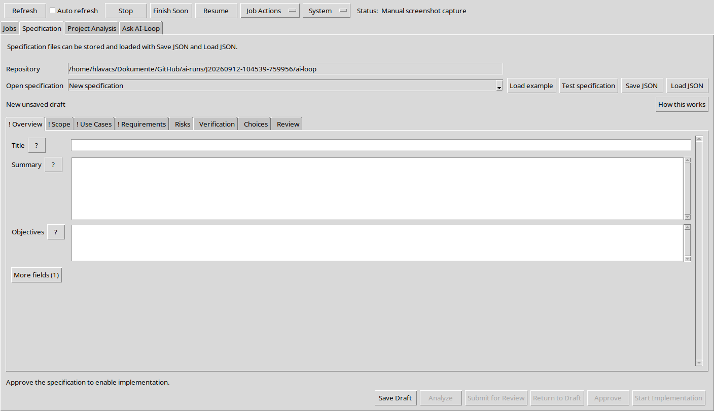
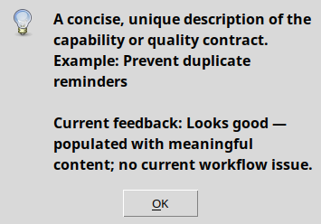
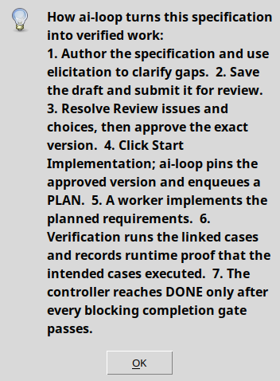
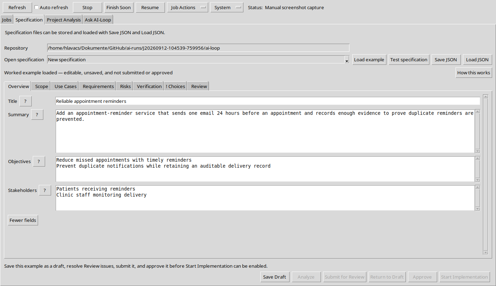
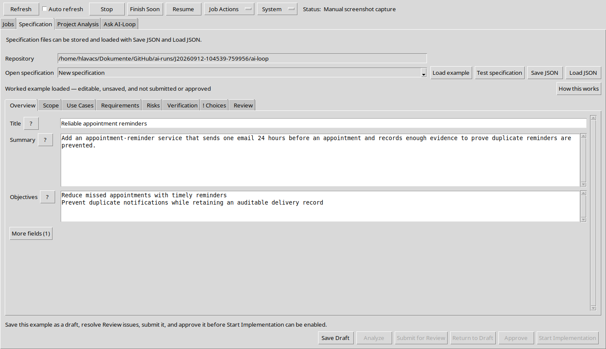
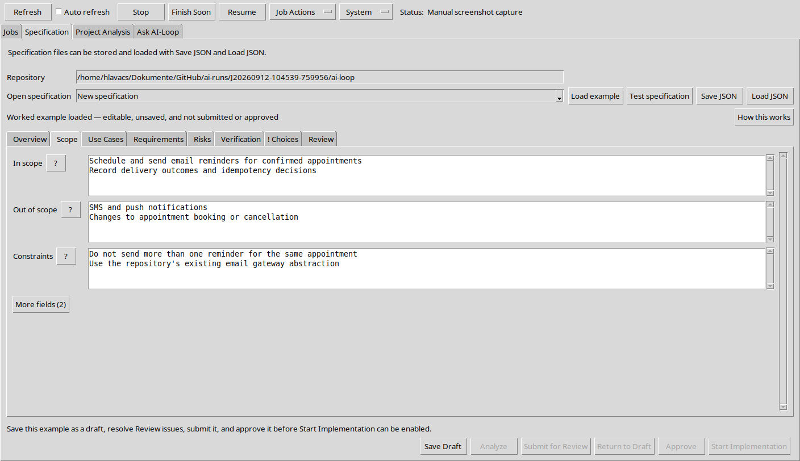
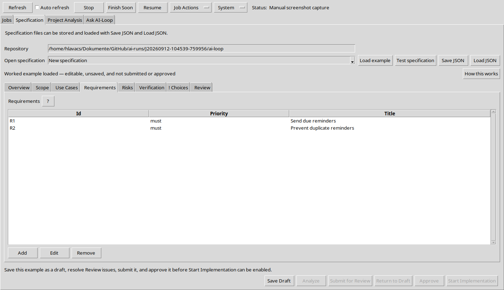
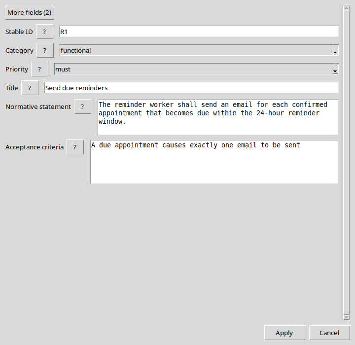
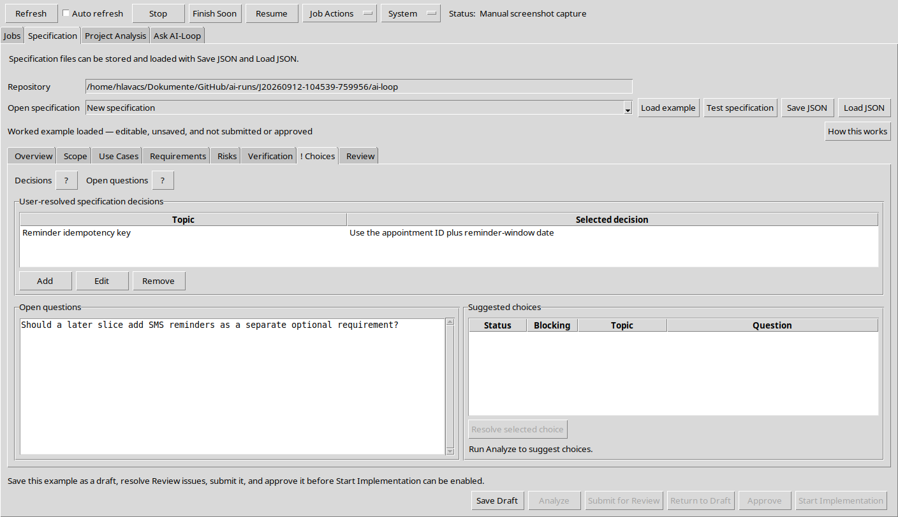
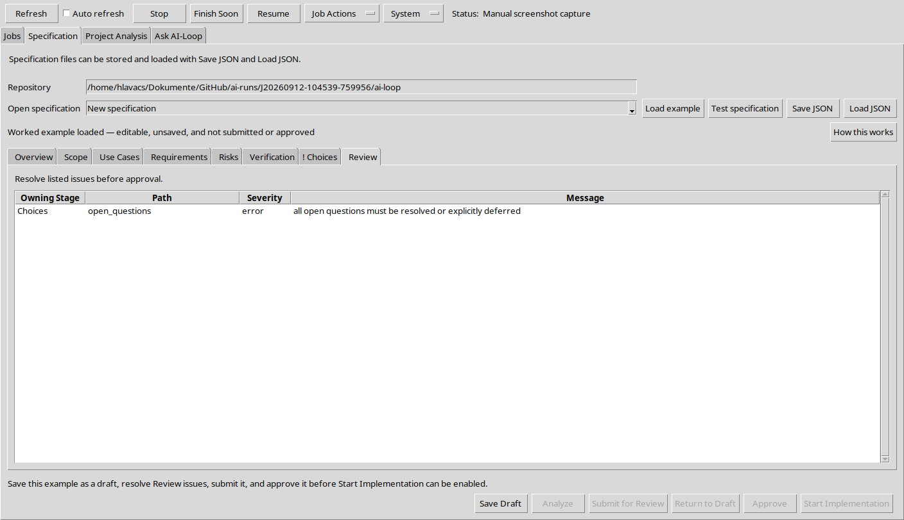

# AI-Loop Specification Handbook

AI-Loop turns an agreed specification into planned, implemented, and verified work. This guide covers the
Specification screen from the first blank draft through `Start Implementation`.

The screenshots are real Tk captures of the current editor. The examples show how the same eight stages work for a
small change and a larger feature.

## 1. The specification in one minute

A specification is the contract for one deliverable. It records:

- the result and its boundaries;
- the user journeys and requirements;
- the risks, design choices, and proof of completion.

AI-Loop stores draft revisions. After review and approval, implementation is pinned to the exact approved version.
Later edits cannot silently change that job.

The tabs run left to right:

1. `Overview`
2. `Scope`
3. `Use Cases`
4. `Requirements`
5. `Risks`
6. `Verification`
7. `Choices`
8. `Review`

Start with a short pass through every tab. Add detail only where the work, risk, or `Review` findings need it.



## 2. Help without clutter

### Field help

Every named input has a `?` button. Select it for:

- what belongs in the field;
- a concrete example;
- feedback about the current value, when available.

Help opens on demand and does not replace what you typed.



### Process help

Select `How this works` for the complete author-to-verification sequence. It is useful when a button is disabled or
when you need to know what happens after approval.



### More fields

The counted More fields button keeps the common path compact. Select it when:

- the hidden context matters to this delivery;
- a risk or blocking test needs stronger evidence;
- `Review` identifies a missing value.

It changes to `Fewer fields` while the extra inputs are visible. Values are preserved when the fields are hidden
again.

On `Overview`, `More fields (1)` reveals `Stakeholders`. On `Scope`, `More fields (2)` reveals `Assumptions` and
`Dependencies`. Record dialogs also use a counted More fields button; these details are listed with each stage below.



## 3. The eight stages

### Overview

Describe the outcome before its implementation.

- `Title`: a short deliverable name.
- `Summary`: the user problem and desired result.
- `Objectives`: measurable outcomes, one per line.
- `Stakeholders` under `More fields (1)`: affected roles, one per line.

Keep `Summary` to a few sentences. Put boundaries in `Scope`, not here.



### Scope

Draw a clear boundary around the delivery.

- `In scope`: work the implementation must include.
- `Out of scope`: deliberate exclusions.
- `Constraints`: non-negotiable limits.
- `Assumptions` under `More fields (2)`: facts treated as true.
- `Dependencies` under `More fields (2)`: external systems, data, libraries, or teams.

Use one boundary per line. Move uncertain or failure-prone assumptions into `Risks` as well.



### Use Cases

Add one complete user journey at a time. The main list shows `Id` and `Title`; use `Add`, `Edit`, or `Remove` to
manage records.

The common record fields are:

- `Stable ID`: an uppercase identifier such as `UC1`.
- `Title`: a short journey name.
- `Actors`: roles taking part, one per line.
- `Ordered main flow`: success steps, one per line.
- `Linked requirement IDs`: existing requirement IDs, one per line.

Open `More fields (5)` before approval. It reveals `Preconditions`, `Trigger`, `Alternate flows`, `Postconditions`,
and `Errors and edge cases`. `Preconditions`, `Trigger`, `Postconditions`, and `Errors and edge cases` are needed for
a complete approval-ready use case; `Alternate flows` is useful when a valid variation matters.

### Requirements

Requirements are the implementation contract. Give every item a stable ID and a measurable result.

The common record fields are:

- `Stable ID`: an uppercase identifier such as `R1`.
- `Category`: `functional` for behavior or `quality` for a quality property.
- `Priority`: `must`, `should`, or `could`.
- `Title`: a concise capability or quality name.
- `Normative statement`: one unambiguous statement of what the result shall do.
- `Acceptance criteria`: observable outcomes, one per line.

Open `More fields (2)` for `Rationale` and `Source`. Both are required for approval. An approval-ready specification
also needs at least one `functional` requirement and one `quality` requirement, and every requirement must be linked
from `Verification`.





### Risks

Record a credible failure, not a vague worry.

The common record fields are:

- `Stable ID`, `Title`, and `Description`: identify the risk, cause, affected requirement, and impact.
- `Severity`: rate the impact.
- `Mitigations`: prevention or recovery measures, one per line.
- `Linked verification IDs`: existing verification IDs, one per line.

`More fields (3)` reveals `Uncertainty`, `Failure modes`, and `Observable detection signals`. Open it for
high-severity or high-uncertainty risks: those risks need concrete failure modes, detection signals, mitigations,
linked verification, metrics, repeated or corrected attempts, retained evidence, and escalation.

### Verification

Verification says how AI-Loop can prove each requirement. Add at least one linked case for every requirement.

The common record fields are:

- `Stable ID`, `Title`, and `Requirement IDs`: identify the case and the requirements it proves.
- `Test level` and `Method`: say where and how proof runs.
- `Independent oracle`: the expected result used to judge the run.
- `Ordered procedure` and `Pass criteria`: execution steps and observable success.
- `Automation`: whether the case runs automatically.
- `Blocking`: whether completion waits for trusted passing proof.

`More fields (13)` reveals `Fixtures`, `Declared metric names`, `Metric assertions`, `Coverage targets`, `Required
evidence`, `Command override`, `Working directory`, `Timeout (seconds)`, `Maximum correction attempts`, `Repetitions
per attempt`, `Stagnation limit`, `Escalation condition`, and `Retain evidence`.

Open it for blocking cases and risky behavior. A blocking case needs `Coverage targets` and an `Escalation condition`;
high-assurance risks also need metrics, retained evidence, and a bounded repeated or correction loop. Use the `?`
button beside any unfamiliar input for its exact format and example.

### Choices

Use this stage for decisions that constrain implementation and questions that are not settled yet.

- `Decisions`: add records with `Topic`, `Selected decision`, and `Rationale`.
- `More fields (2)` in a decision reveals `Rejected alternatives` and `Consequences`.
- `Open questions`: one unresolved question per line.
- `Suggested choices`: proposals created by `Analyze`.

Select `Resolve selected choice` for a suggested item. The resolution asks for `Selected option`, `Rationale`, and
`Defer`. A blocking choice cannot be deferred. Clear or resolve every `Open questions` item before approval.



### Review

`Review` is the live completion checklist. Each row shows `Owning Stage`, `Path`, `Severity`, and `Message`. An
exclamation mark on a tab also signals an issue or advisory field feedback there.

Fix an issue in its owning tab, then return to `Review`. Use `Test specification` for a read-only holistic check of
the current editor content. It does not save or change workflow state.



## 4. Saving and starting work

The normal sequence is:

1. Select `Save Draft`. The first save creates a stored specification; later saves create draft revisions.
2. Optionally select `Analyze` on a clean stored draft, inspect the exact suggested changes and choices, and apply
   only what you accept.
3. Resolve every row in `Review` and every blocking suggested choice.
4. Select `Submit for Review`. Unsaved editor changes must be saved first.
5. If edits are needed, select `Return to Draft`, change the fields, and select `Save Draft` again.
6. Select `Approve`. Approval records the exact submitted version and the approving user.
7. Select `Start Implementation`. AI-Loop pins that approved version to a new job and queues its initial `PLAN` task.

`Start Implementation` is enabled only for an unchanged approved version when implementation is available. The
worker implements the planned requirements; linked verification records runtime proof. The controller reaches
`DONE` only after every blocking completion gate passes.

`Save JSON` and `Load JSON` are file exchange tools. They do not replace `Save Draft`, submission, or approval.
`Load example` fills a new unsaved editor so you can explore the form.

## 5. Worked example A: a small focused change

This example adds a quiet mode to one existing command. It is small, but it still separates behavior from quality
and proves both in one case.

### Overview

- `Title`: Quiet sync output
- `Summary`: Add `--quiet` to the sync command so scripts can suppress progress while errors and exit status remain
  visible.
- `Objectives`: Quiet success emits no progress text; failures remain diagnosable.
- `Stakeholders`: CLI operators and automation authors.

### Scope

- `In scope`: parse `--quiet`; suppress informational sync progress.
- `Out of scope`: changing log files, error wording, or other commands.
- `Constraints`: preserve current exit codes and standard-error output.
- `Assumptions`: the sync command already separates progress and error output.
- `Dependencies`: the existing CLI parser and sync test fixture.

### Use Cases

`UC1 — Run a quiet sync`

- `Actors`: CLI operator.
- `Preconditions`: a valid configured repository exists.
- `Trigger`: the operator runs `ai-loop sync --quiet`.
- `Ordered main flow`: parse the option; run sync; suppress progress; return the existing status.
- `Alternate flows`: without `--quiet`, keep current progress output.
- `Postconditions`: a successful quiet run has empty standard output.
- `Errors and edge cases`: a failed quiet run keeps its standard-error message and non-zero status.
- `Linked requirement IDs`: `R1`, `R2`.

### Requirements

`R1 — Suppress progress in quiet mode` is `functional` and `must`. The command shall emit no informational progress
to standard output when `--quiet` is present. Acceptance: a successful quiet fixture has empty standard output.
Rationale: scripts need stable, silent success. Source: CLI operator request.

`R2 — Preserve failure signals` is `quality` and `must`. Quiet mode shall preserve current error output and exit
codes. Acceptance: a failing fixture retains its expected standard-error text and non-zero status. Rationale:
silence must not hide failure. Source: automation compatibility policy.

### Risks

`RISK1 — Hidden sync failure` has `medium` severity and `low` uncertainty. Its `Description` names `R2`: broad
output suppression could hide a failure. Mitigation: apply quiet filtering only to informational progress. `Linked
verification IDs`: `VT1`.

### Verification

`VT1 — Quiet output contract` links `R1` and `R2`. It is an automated, blocking integration case.

- `Independent oracle`: captured standard output, standard error, and return status for fixed success and failure
  fixtures.
- `Ordered procedure`: run both fixtures with `--quiet`; capture all three outputs; compare them with the oracle.
- `Pass criteria`: success standard output is empty; failure text and non-zero status are unchanged.
- `Coverage targets`: quiet success and quiet failure paths.
- `Escalation condition`: stop for review if output channels still differ after one correction attempt.

### Choices

Decision `Quiet output boundary`: suppress informational standard output only. Rationale: this meets `R1` without
weakening `R2`. There are no `Open questions`.

### Review

Traceability resolves: `UC1 → R1, R2 → VT1`; `RISK1 → VT1`. Confirm `Review` is empty, then use `Save Draft`,
`Submit for Review`, `Approve`, and `Start Implementation` in order.

## 6. Worked example B: a larger feature

This example adds reliable appointment reminders. It has two journeys, four requirements, two risks, and two
verification cases. The stage order is unchanged; only the number and depth of records grows.

### Overview

- `Title`: Reliable appointment reminders
- `Summary`: Send one email 24 hours before a confirmed appointment and retain proof that retries do not duplicate
  delivery.
- `Objectives`: reduce missed appointments; prevent duplicates; retain auditable outcomes.
- `Stakeholders`: patients, clinic staff, and support staff.

### Scope

- `In scope`: schedule email reminders; send through the existing gateway; record delivery outcomes.
- `Out of scope`: SMS, push notifications, and appointment booking changes.
- `Constraints`: at most one reminder per appointment and reminder window; use the existing gateway abstraction.
- `Assumptions`: appointment timestamps and email addresses are already validated.
- `Dependencies`: appointment store, clock fixture, and email gateway test double.

### Use Cases

`UC1 — Send a due reminder` links `R1`, `R2`, and `R4`. The scheduled worker finds a confirmed appointment due in
24 hours, sends one email, and stores one receipt. Repeated scans find the receipt and do not send again. Missing or
invalid recipients are recorded as errors.

`UC2 — Recover from a temporary gateway failure` links `R2`, `R3`, and `R4`. The first gateway call fails before
acceptance; a bounded retry later succeeds under the same idempotency key. The final state contains one success
receipt and an audit trail of both attempts.

For both records, fill `Actors`, `Preconditions`, `Trigger`, `Ordered main flow`, `Postconditions`, `Errors and edge
cases`, and the stated `Linked requirement IDs`.

### Requirements

- `R1 — Send due reminders` (`functional`, `must`): each eligible confirmed appointment shall cause one email in the
  24-hour window. Acceptance: the due fixture produces one matching email.
- `R2 — Prevent duplicate reminders` (`quality`, `must`): repeated processing shall remain idempotent. Acceptance:
  three scans produce one email and one success receipt.
- `R3 — Retry temporary failures` (`functional`, `should`): retry a pre-acceptance transient failure within the
  configured limit. Acceptance: fail-then-succeed produces one final delivery.
- `R4 — Retain delivery evidence` (`quality`, `must`): store the idempotency key, outcome, and attempt time.
  Acceptance: every attempted delivery has an auditable record.

Add a short `Rationale` and `Source` for each record: clinic operations owns `R1` and `R3`; patient support policy
owns `R2`; audit policy owns `R4`.

### Risks

- `RISK1 — Duplicate delivery` is `high` severity. Its `Description` names `R2`: a retry after an ambiguous response
  might send a second email. Mitigation: claim a persistent unique idempotency key before sending. `Linked
  verification IDs`: `VT1`.
- `RISK2 — Gateway outage` is `medium` severity. Its `Description` names `R3` and `R4`: repeated rejection might
  exhaust retries or lose the attempt history. Mitigation: bound retries and persist every outcome. `Linked
  verification IDs`: `VT2`.

For `RISK1`, open `More fields (3)` and record the ambiguous-response `Failure modes`, duplicate-count `Observable
detection signals`, and uncertainty.

### Verification

`VT1 — Reminder retry remains idempotent` links `R1`, `R2`, and `R4`. It is automated, blocking, and integration
level. Run the same due appointment three times against a deterministic gateway. The oracle is one matching outbox
record and one success receipt. Declare `notifications_sent` and `duplicate_notifications`; assert
`notifications_sent == 1` and `duplicate_notifications == 0`. Use three `Repetitions per attempt`, retain the test
log and receipt snapshot in `Required evidence`, select `Retain evidence`, and define an `Escalation condition`.

`VT2 — Temporary failure recovers` links `R3` and `R4`. It is automated, blocking, and integration level. A gateway
fixture rejects once and accepts once. The oracle is one final email plus two ordered attempt records. Its `Pass
criteria` require one success, no extra retry, and a complete audit trail. Add the fail-then-succeed path to
`Coverage targets` and define an `Escalation condition`.

### Choices

Decision `Reminder idempotency key`: use appointment ID plus reminder-window date. Rationale: it is stable across
retries and changes for a later reminder window. Record the process-local sent set under `Rejected alternatives`
and the persistent uniqueness constraint under `Consequences`. There are no `Open questions` at approval time.

### Review

Traceability resolves:

- `UC1 → R1, R2, R4 → VT1`
- `UC2 → R2, R3, R4 → VT1, VT2`
- `RISK1 → VT1`
- `RISK2 → VT2`

Check that `Review` is empty and no blocking item remains in `Suggested choices`. Then run the same four actions as
the small example: `Save Draft`, `Submit for Review`, `Approve`, `Start Implementation`.

## 7. Final checklist

Before `Submit for Review`:

- every journey links real requirement IDs;
- both `functional` and `quality` requirements exist;
- every requirement links from at least one verification case;
- every risk links only real verification IDs;
- blocking cases have an oracle, procedure, pass criteria, coverage target, and escalation condition;
- high-assurance risks have metrics, a bounded loop, and retained evidence;
- `Open questions`, `Suggested choices`, and `Review` have no blocking unresolved item;
- the latest edits have been saved with `Save Draft`.

If a field is unclear, select its `?` button. If the lifecycle is unclear, select `How this works`.

## 8. PDF edition

The PDF uses the same ReportLab toolchain as the ICODA illustrated handbook. From the repository root, rebuild it
with:

```bash
ai-loop/.gui-venv/bin/python ai-loop/docs/build_handbook_pdf.py
```

The command reads this file and writes `ai-loop/docs/AI-Loop-Handbook.pdf`. Each Markdown image and its caption is
placed on a dedicated landscape figure page so the GUI remains legible.
