# ICODA Handbook

ICODA (Interactive Code Development and Analysis) is a desktop application for developing software in small,
reviewable steps. It combines a formal project specification, a derived architecture model, command-line LLM
providers, isolated Git worktrees, build and test gates, and an explicit developer approval loop.

This handbook describes the behavior implemented in ICODA 0.1.0. `EVOLUTION.md` and `ICODA_PLAN.md` describe the
design and its history; this file is the practical guide for using and maintaining the current application.

New users should start with the two-page `docs/GETTING_STARTED.md`, then `docs/TUTORIAL.md`; `docs/TROUBLESHOOTING.md`
collects the usual problems and their fixes. The **Help** menu in ICODA opens all of them.

The screenshots are real Tk captures produced from deterministic acceptance fixtures. They show both C++ and
Python projects so that the workflow is not mistaken for a language-specific design.

## 1. The ICODA mental model

ICODA is built around five ideas:

1. **The specification and source code are the project truths.** The specification says what the system should do
   and the source says what it currently does.
2. **The architecture view is derived.** ICODA parses the project and computes files, entities, calls, type
   relations, clusters, requirements, test evidence, and implementation status. The diagrams are not a separate
   model that must be maintained by hand.
3. **Development proceeds in phases.** A project moves from `specification` to `architecture` and then to
   `implementation`. The current phase controls which actions are available.
4. **Every proposed code change is isolated and verified.** The LLM response is applied in
   `.icoda/worktree`, built, tested, parsed, and compared with the current project before approval is enabled.
5. **The developer owns the decisions.** Architecture, implementation approaches, API signature changes, and
   failed gates remain visible decisions. Automatic approval is deliberately bounded.

ICODA currently supports C++ projects built with CMake presets and Python projects analysed with the standard
library `ast` parser. The GUI is a native Tk desktop application; there is no web interface or background service.

## 2. Installation and launch

### Common prerequisites

- Git
- Python 3.10 or newer with Tkinter
- At least one supported provider CLI if code generation will be used

For C++ projects, also install:

- CMake 3.28 or newer
- Ninja
- Clang and a compatible libclang
- `clang-scan-deps` when C++20 modules are used
- vcpkg when the project or its Code Profile requires it

On macOS, generated C++ module projects normally need Homebrew LLVM because Apple Clang does not provide the CMake
module-scanning configuration used by the generated skeleton:

```bash
brew install llvm cmake ninja
```

### Start ICODA

On macOS or Linux:

```bash
./icoda.bash
./icoda.bash /absolute/path/to/project
```

On Windows:

```bat
icoda.cmd
icoda.cmd C:\path\to\project
```

Bootstrap the environment explicitly from the repository's `icoda` directory. `constraints.txt` pins every runtime
and development dependency used by this checkout; the three launchers (`icoda.bash`, `icoda_python.bash`, and
`icoda.cmd`) only select/check Python, Tkinter, tools, and the already prepared environment. They never install or
upgrade packages:

```bash
python3 -m venv .icoda-venv
.icoda-venv/bin/python -m pip install -e '.[dev]' -c constraints.txt
./icoda.bash
```

On Windows, use `py -3.12 -m venv .icoda-venv`, then
`.icoda-venv\Scripts\python.exe -m pip install -e ".[dev]" -c constraints.txt`, then `icoda.cmd`. Repeat the pinned
install after `pyproject.toml` or `constraints.txt` changes.

The distributable wheel path is also exercised offline by the test suite. From an environment that already has the
pinned build tools and runtime dependencies, build and install it with:

```bash
.icoda-venv/bin/python -m pip wheel --no-deps --no-build-isolation -w dist .
.icoda-venv/bin/python -m pip install --no-deps dist/icoda-0.1.0-py3-none-any.whl
.icoda-venv/bin/icoda
```

The wheel contains `icoda.py`, both packages, the provider registry, and both JSON schemas. `--no-build-isolation`
and `--no-deps` make this path fully offline; prepare dependencies with the pinned bootstrap before disconnecting.

### Authenticate a provider

ICODA invokes provider command-line tools; it does not implement their login flows. Authenticate the selected CLI
before starting a proposal. The currently enabled providers use:

```bash
claude                 # complete the interactive login
codex login
```

Provider availability and invocation compatibility can be checked without consuming model usage:

```bash
.icoda-venv/bin/python -m icoda_core.provider_check \
  --output .icoda-test-artifacts/provider-qualification.json
```

## 3. Starting a project

### Create a new project

1. Choose **File > New Project...** (Ctrl+N; ⌘N on macOS).
2. Select an empty directory.
3. Complete the Specification window.
4. Press **Validate**, resolve any reported problems, and press **Save** (Ctrl+S / ⌘S).
5. Answer **Yes** when ICODA offers to build the skeleton. The build runs in the background and the project is
   analysed when it passes. **Project > Build** (Ctrl+B / ⌘B) repeats this at any time.

At every point the sentence above the buttons in the lower panel names the next action.

Saving the first specification creates only files that do not already exist. It generates either a C++ CMake
skeleton or a Python skeleton according to the Code Profile, then moves the project into the `architecture` phase.

An empty directory initially receives the C++ defaults. To create a Python project, select `Python` and review all
language-dependent Code Profile fields before saving. A practical Python profile is:

| Field | Typical value |
|---|---|
| Standard | `3.12` |
| Test framework | `pytest` |
| Test runner | `python -m pytest` |
| Test files | `tests/test_<module>.py` |
| Source extension | `.py` |
| Module naming | `snake_case` |
| Class naming | `PascalCase` |
| Function naming | `snake_case` |
| Libraries | `PyPI dependencies declared in pyproject.toml` |

### Open an existing CMake project

1. Commit or otherwise safeguard the current project first.
2. Build it once with compile-command export enabled.
3. Choose **File > Open Project...** and select the project root.
4. If analysis reports no compile database, generate `compile_commands.json` as described below and reload.
5. Open **Project > Specification...** to add or edit the formal specification.

ICODA searches for the newest `compile_commands.json` at the project root, in `build/`, or in a direct child of
`build/`. For a CMake project, use:

```bash
cmake --preset debug
cmake --build --preset debug
```

The preset must set `CMAKE_EXPORT_COMPILE_COMMANDS=ON`. The generated ICODA presets already do this.

An existing CMake project with no ICODA state starts in the `implementation` phase. Its existing functions are
treated as implemented rather than as a new architecture skeleton.

### Open an existing Python project

ICODA recursively analyses `.py` files without importing or executing them. A directory without `CMakeLists.txt`
starts in the `specification` phase when it has no existing `.icoda/state.json`. Saving its first specification may
add missing Python skeleton files. Commit the project first and inspect the resulting files, especially when the
directory is not empty.

### What happens on the first proposal

Before asking a provider, ICODA prepares step 0:

- It creates `.icoda/` and the ignored proposal worktree.
- It initializes a Git repository if the project is not already its own repository.
- It builds and analyses the project when a fresh derived model is unavailable.
- It records the current skeleton/model as step 0.
- It creates an `icoda step 0: skeleton` commit.

Start with a clean, intentional working tree. On a project with no earlier ICODA step, step 0 commits the files that
constitute the starting point. Later uncommitted edits are refused until they are handled explicitly.

## 4. Writing the specification

Open the editor with **Project > Specification...**. It has six pages and uses JSON Schema validation before save.
Hover over a field or its label for an example.

### Overview

- **Title**: a short project name; this is the only field that may not be empty.
- **Description**: what the program is, who uses it, and the outcome it provides.

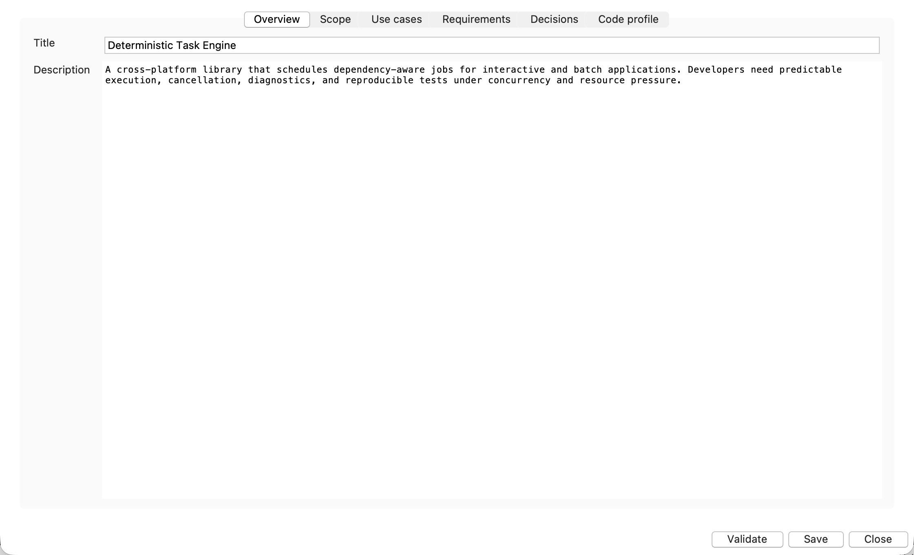

*Overview anchors the rest of the specification in a concrete product and audience.*

### Scope

- **Goals**: desired outcomes, one per line.
- **Not in scope**: features or qualities deliberately excluded.
- **Not allowed**: forbidden libraries, techniques, dependencies, or implementation choices.
- **Done when**: observable completion conditions.

Write exclusions as carefully as goals. They prevent a provider from broadening a bounded step into an attractive
but unwanted subsystem.

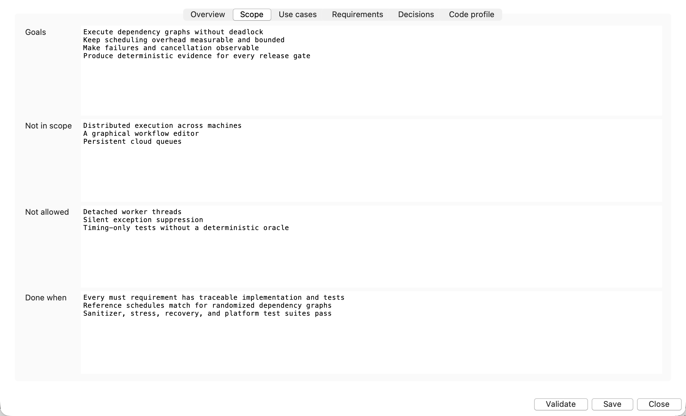

*Scope records what success includes, what it excludes, and which implementation shortcuts are forbidden.*

### Use cases

Use cases describe externally meaningful behavior. **Add** assigns stable IDs such as `UC-1`; **New** clears the
form; **Remove** deletes the selected record. Include the main path and important alternate paths in the details.

For a complex system, use separate records for:

- normal operation;
- invalid input and boundary values;
- resource exhaustion and partial failure;
- cancellation, restart, and recovery;
- persistence and compatibility behavior;
- concurrency, timing, or ordering behavior where relevant.

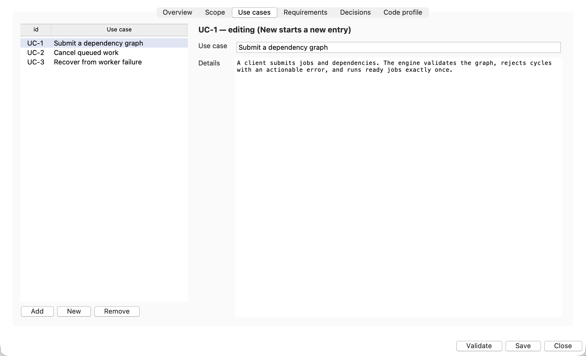

*Use cases are stable, numbered behavioral records rather than a single unstructured prompt.*

### Requirements

Each requirement receives an `R-n` ID, a priority, optional use-case references, and details. A requirement should
be independently testable. Prefer measurable language such as:

> R-4: Cancelling a queued job prevents it from starting. Cancellation completes within 100 ms and does not affect
> jobs that are already running.

Priorities mean:

- `must`: the project is unacceptable without it;
- `should`: important, but not a release blocker in every context;
- `could`: explicitly optional.

Use-case references must name existing `UC-n` IDs. Validation rejects unknown references and duplicate IDs.

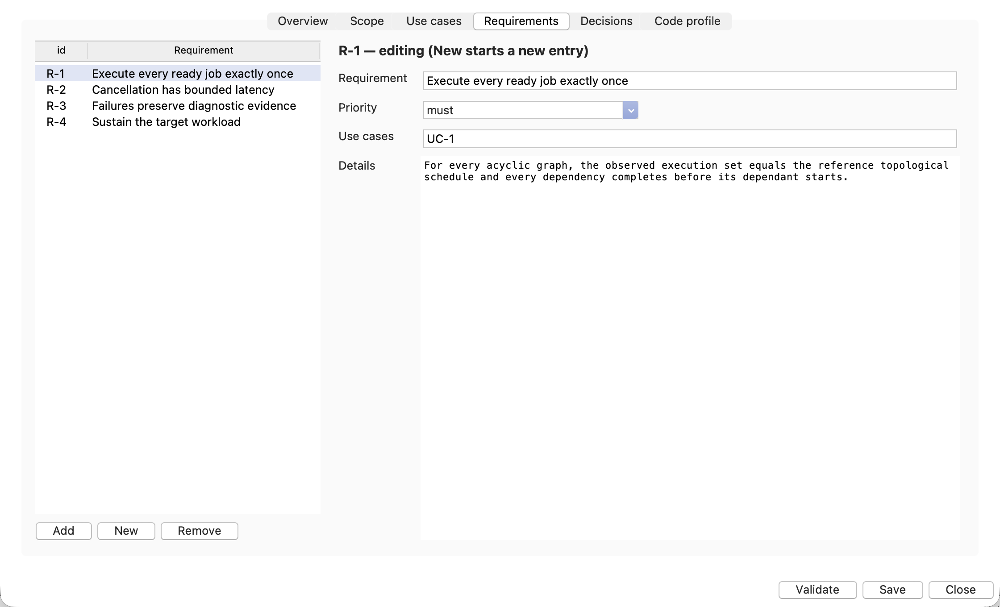

*Requirements connect measurable behavior to use cases and a release priority.*

### Decisions

Decisions record choices that should not be reopened in every prompt. Examples include the language, rendering or
storage library, threading policy, public API constraints, ownership model, persistence format, and compatibility
strategy. Record the rationale when it will help a later proposal preserve the intent rather than only the syntax.

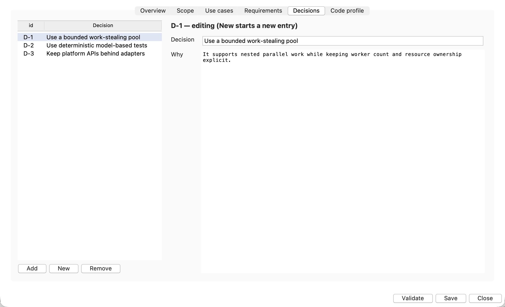

*Decisions preserve architectural intent so later proposals do not repeatedly reopen settled questions.*

### Code Profile

The Code Profile constrains generated code and supplies build/test conventions. Review at least:

- language and standard;
- C++ module use;
- target platforms;
- test framework and test runner;
- test-file and source-file conventions;
- module, class, and function naming;
- library policy;
- function-size budgets used in prompts and few-line grouping;
- class-size limits (methods and data members);
- project-specific style rules.

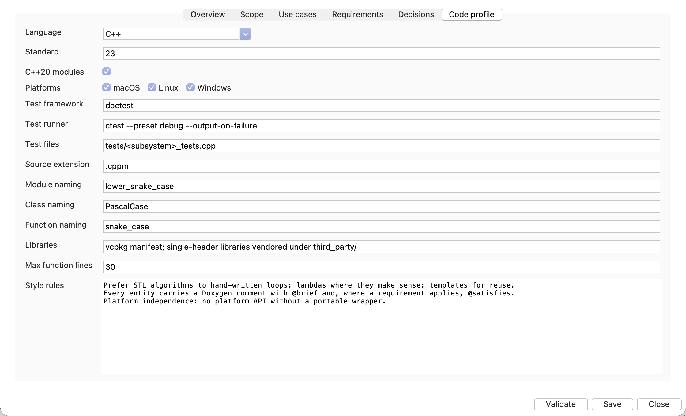

*The Code Profile turns project conventions into explicit generation and verification constraints.*

The Code Profile's `max_function_lines` and `hard_max_function_lines` values bound few-line grouping and inform the
provider. The promotion rule itself is deliberately fixed: `FUNCTION_LINE_GUIDELINE` is 30 and
`FUNCTION_LINE_HARD_MAX` is 50. Other editable profile budgets cover methods and data members. Only the generated
build settings (`build`) are kept in the JSON without an editor field; change those with ICODA closed, then check
them by reopening the editor and pressing **Validate**.

### A quality checklist

Before leaving the specification phase, confirm that:

- every goal describes an outcome rather than an implementation activity;
- exclusions and forbidden choices are explicit;
- use cases cover normal, boundary, failure, and recovery paths;
- requirements are testable and include relevant limits;
- high-risk behavior has an independent oracle or reference result;
- important architecture choices and their rationale are recorded;
- completion requires passing tests, not merely compiling;
- the Code Profile matches the actual toolchain and project layout.

The current editor validates structure and references. It does not yet conduct an AI-guided interview, discover
missing requirements, or prove that the specification is complete. That review remains a developer responsibility.

### Link specification items to code

The Coverage view maps exact `@satisfies` tags to requirements. Requirements use their `R-n` ID; goals use their
position as `G-1`, `G-2`, and so on.

C++ example:

```cpp
/// @brief Cancels a job that has not started.
/// @satisfies R-4
bool cancel(JobId id);
```

Python example:

```python
def cancel(job_id: JobId) -> bool:
    """Cancel a queued job.

    @satisfies R-4
    """
```

Matching is exact; text similarity is not used. Because goal IDs are positional, avoid reordering goals casually
after code has been tagged.

## 5. Main window tour

### Menus

**File** creates, opens, reloads, and remembers projects. **Project** opens the specification, builds the project,
sets the test command, opens the libclang chooser, starts proposals, approves the architecture, undoes the last
approved step, or commits manual edits. **View** opens the analysis surfaces, fits diagrams, and toggles
recorded test reachability colours. **Help** opens Getting started, the Tutorial, this handbook and Troubleshooting, opens the current log
file, and shows the version and file locations.

Keyboard shortcuts (Command on macOS, Control elsewhere): N new project, O open project, R reload, E specification,
B build, Return propose the next step, Q quit; in the specification editor S saves and W closes.

### The step panel

The lower panel is driven by the project's phase. One sentence above the buttons says what to do next; it changes
with every event (analysis running, proposal ready, signature confirmation needed, approach approved, queue empty,
automatic approval paused). Only the buttons that belong to the phase are shown: none in `specification`;
**Propose**, **Approve**, **Reject...**, **Adapt...**, **Approve architecture** and **Undo last step** in
`architecture`; **Propose approach**, **Approve approach**, **Propose**, **Approve**, **Reject...**, **Adapt...** and
**Undo last step** in `implementation`. **Confirm signatures** appears only when a proposal changes signatures.
**More...** holds the rare actions **Rebuild**, **Open worktree** and **Commit manual edits**. A grey button is still
explained: its tooltip says what it does, when it is available, and why it is grey now.

While a step runs, the buttons are replaced by a moving bar, the current activity (`asking the agent for the next step
(attempt 1 of 3)`, `building the proposal`, ...) and, for agent calls, builds and tests, a **Cancel** button. Cancel
kills the running process; the step ends with `cancelled — nothing was recorded` and the panel keeps its previous
content. Approving, undoing and committing cannot be cancelled because they change the project.

The detail tabs are **Approach**, **Delta**, **Signatures**, **Summary**, **Diff**, **Build**,
**Tests**, **Prompt** and **Reply**. The last two show exactly what was sent to the agent for the displayed item and
what came back, so that a puzzling proposal can be traced to its cause.

### Shared graph controls

The controls above the view tabs affect the reusable diagrams:

- **Filter** hides nodes that do not match.
- **Neighborhood** dims nodes more than the chosen graph distance from the selected entity; `0` disables it.
- **Collapse all** collapses the shared Project -> Cluster -> File -> Class -> Function hierarchy.
- The `-`, **Fit**, **100%**, and `+` controls adjust the current diagram.

The filter accepts space-separated terms. Plain text searches names; qualified terms include:

```text
name:render
kind:function
status:stub
covered:true
stale:false
cluster:core
namespace:app
edge:calls
```

Terms can be combined. Quoted values are accepted. An invalid or unfinished quote is handled as plain text rather
than crashing the filter. `covered:true` matches the structural recorded test reachability index; it is not a test
assurance or runtime execution filter.

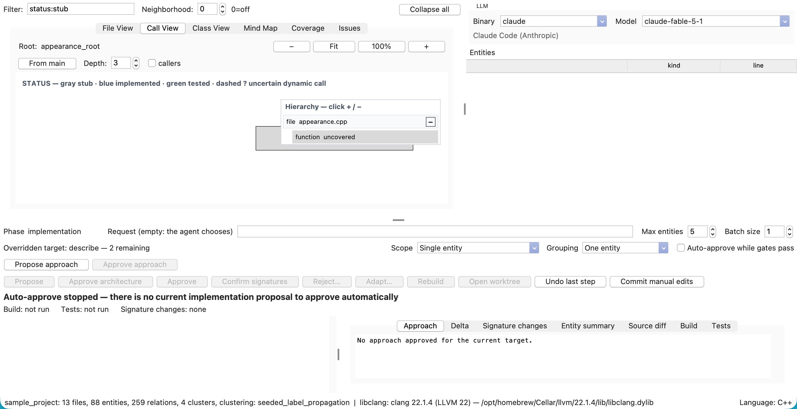

*Qualified filters narrow a large graph to the entities relevant to the current question.*

### Diagram interaction

- Scroll over a diagram to zoom around the pointer.
- Drag with the left or middle mouse button to pan.
- Click `+` or `-` in the hierarchy panel to expand or collapse a level.
- Hover over a node for source and status details.
- Double-click a source entity to open it in the configured editor.
- Right-click a node for actions that are valid in the current phase.

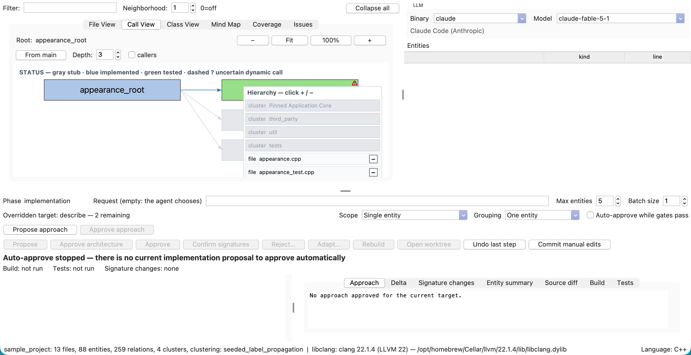

*Neighborhood mode keeps local context prominent while retaining the shape of the surrounding graph.*

The right-click menu can show an entity's introducing step, focus an architecture proposal, override the current
implementation target, run recorded tests, pin or rename a cluster, or pin a file to a chosen cluster. Disabled
items explain that the action is not valid for the current node or workflow state.

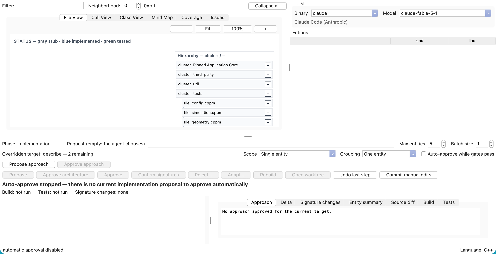

*The hierarchy remains available beside every graph; cluster names and file pins survive reloads.*

### Views

**File View** shows project files, dependency clusters, typed relations, and external libraries. Clicking a file
lists its entities in the right sidebar. Cluster names and pins are persisted.

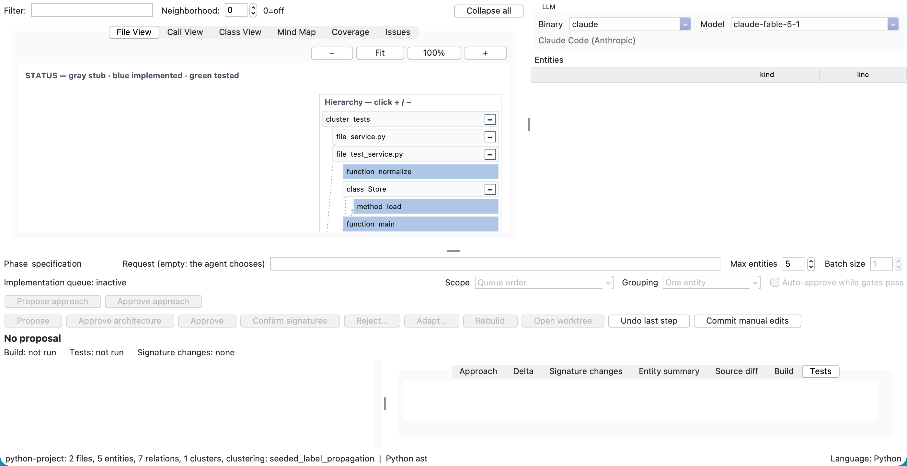

*File View joins dependency structure with the expandable source hierarchy.*

**Call View** shows a function-level graph from a selected root. Use **From main**, **Depth**, and **callers** to
change the traversal. Recursion is drawn as a loop; uncertain dynamic calls are dashed and marked `?`. A proposal's
added and changed entities receive distinct outlines.

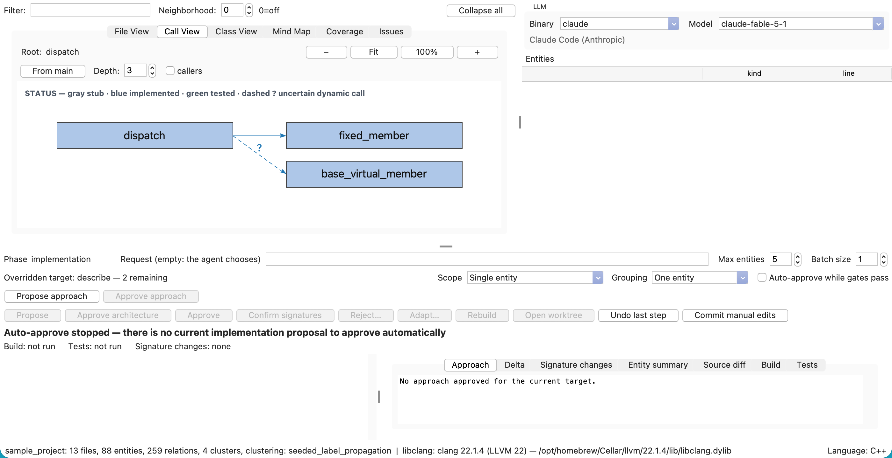

*Dashed edges and a question mark preserve uncertainty instead of presenting dynamic dispatch as a false fact.*

**Class View** shows classes and structs with fields and methods. It distinguishes inheritance, composition,
aggregation, and usage relations. Callable members include their implementation status.

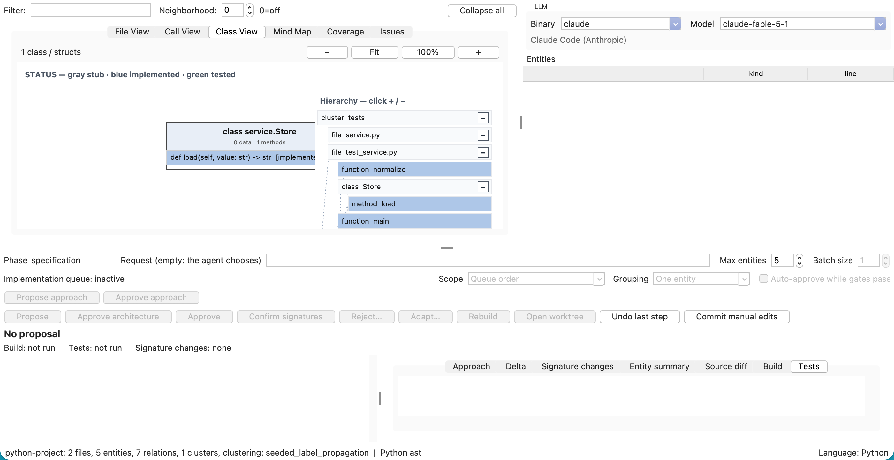

*Class View makes member signatures and implementation status reviewable as architecture.*

**Mind Map** is a persistent hierarchy of clusters, files, classes, and functions. Nodes include status,
requirement IDs, and the introducing step. Clicking an expandable node changes its persisted expansion state;
clicking a node with history also loads that step into the review panel.

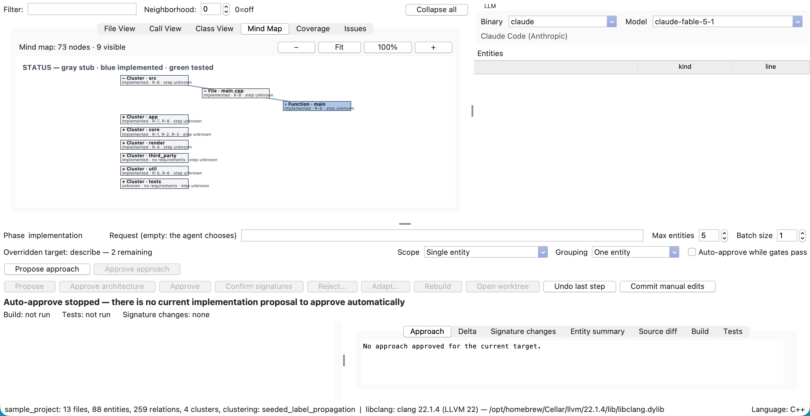

*The Mind Map connects structure to requirements and the step that introduced it.*

**Coverage** has two independent sections:

- specification traceability from exact `@satisfies` tags;
- recorded test reachability for analysed callables from successful step records and static call edges.

Double-click a callable row to open its source location. The second section is a structural provenance index: it
does not inspect assertions, execute tests, verify behavior, or measure statement/branch coverage.

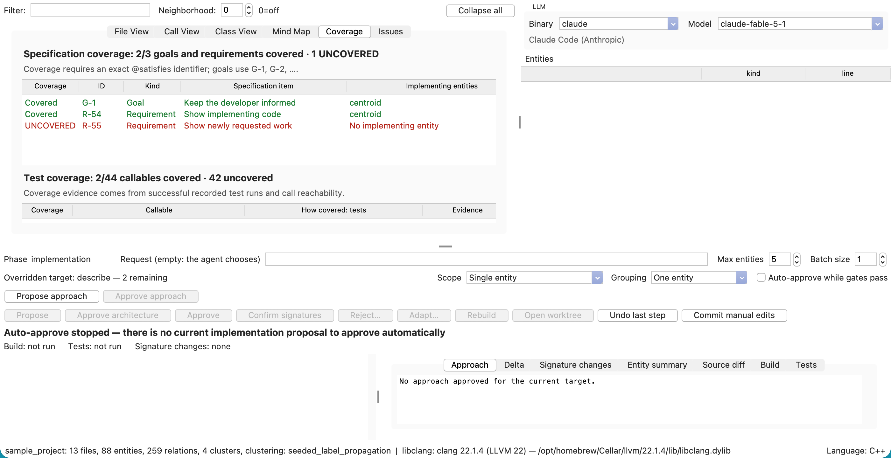

*Requirement traceability and structural recorded test reachability are reported as separate dimensions.*

**Issues** lists advisory code-rule findings such as missing documentation, missing `@satisfies`, large functions,
large classes, too many parameters, direct platform API use, and callables with no structurally reaching recorded
test identifier. Double-click a row to open the source.

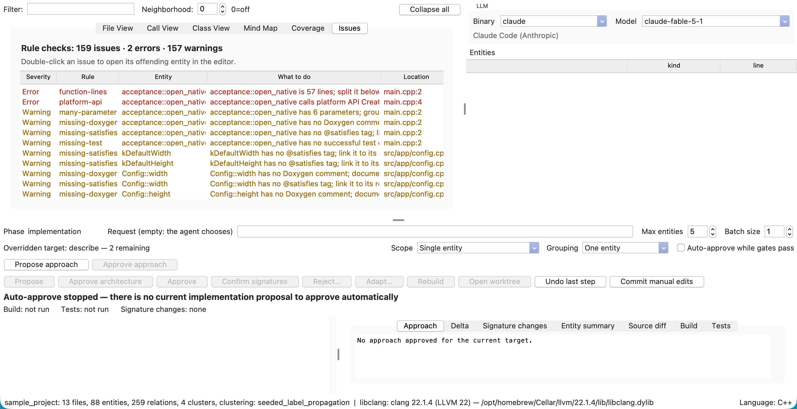

*Issues turn Code Profile rules and missing evidence into a source-oriented review queue.*

### Status and colours

In normal status mode, callable nodes are gray for `stub`, blue for `implemented`, and green for `tested`. The
recorded test reachability colour mode uses green for reached and red for not reached. A red warning marker means
the whole derived model or an entity's recorded evidence is stale.

Issue findings are currently advisory except where a specific workflow gate, such as the grouped-step requirement
for a structurally reaching recorded test identifier, explicitly enforces them.

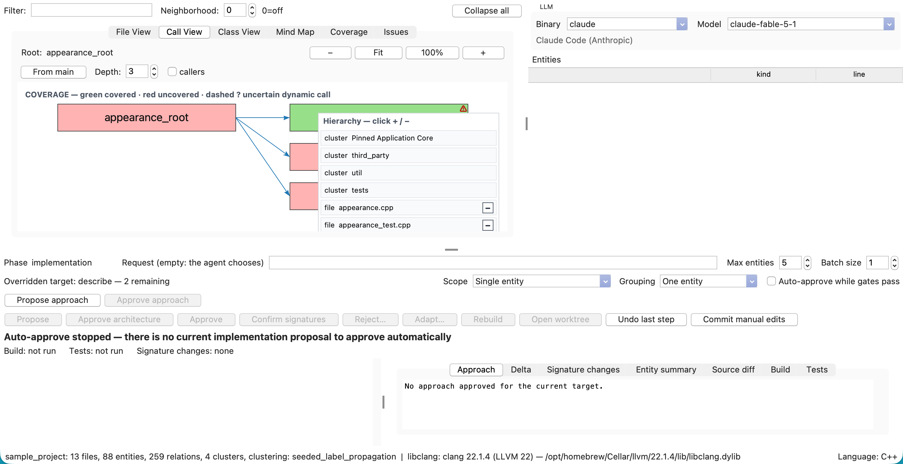

*The colour mode makes structural recorded test reachability visible directly on a graph.*

## 6. LLM selection

The compact LLM panel contains two editable fields:

- **Binary** is the executable name or full path.
- **Model** contains the models configured for the resolved binary, but also accepts a typed model ID.

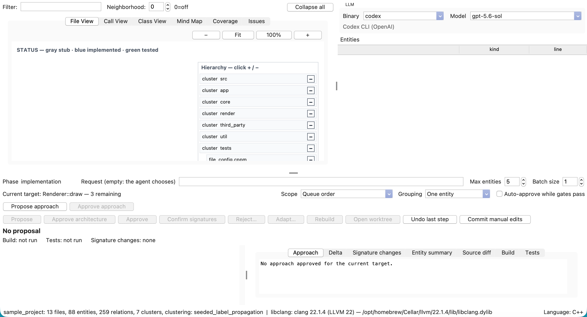

*The selector keeps the executable, provider-specific model, and resolved provider identity together in one compact panel.*

Changing the binary updates the model list and remembers the model used for each provider during the session. The
selection is stored per project in ignored `.icoda/ui.json` and as the default in the user configuration.

The shipped provider registry contains Claude Code, Codex CLI, Gemini CLI, OpenCode, Aider, GitHub Copilot CLI, and
Qwen Code. Only Claude and Codex are currently enabled and marked verified. The other entries, including Gemini,
remain hidden from the normal Binary dropdown until their invocation is qualified locally and their
`enabled`/`verified` fields in `icoda_core/providers.json` are deliberately updated.

A full path still resolves to a provider by executable basename. An unknown binary can be typed, but ICODA cannot
invoke it because it has no command template; the field displays that warning directly.

Provider calls are bounded to 30 minutes. ICODA retries rate-limit responses up to three times, following a
provider-supplied delay when it can parse one. A malformed proposal is also re-requested up to three times with
validation or build feedback.

Provider subprocesses receive the prompt on standard input and cannot edit the checkout: Claude Code is invoked
with `--disallowedTools Edit,Write,MultiEdit,NotebookEdit,Bash`, and Codex CLI with `--sandbox read-only`. All
commands use argument arrays with `shell=False`; bounded subprocess handling limits time and retained output and
kills the process group on timeout or cancellation. ICODA itself applies only the validated structured reply in
the isolated Git worktree.

Both response parsers enforce `MAX_RESPONSE_BYTES` (200,000 bytes) before searching for or parsing JSON. Validation
refuses lone Unicode surrogates as invalid UTF-8, refuses NUL bytes in candidate paths (a literal NUL also makes JSON
invalid), and rejects absolute, parent-traversing, metadata, and build-output paths. `response.apply_changes`
resolves every destination against the worktree root and refuses a symlink escape before writing or deleting.

## 7. Architecture workflow

The architecture phase grows the structural skeleton in small increments. Functions introduced here should remain
stubs; behavior is implemented later.

### Propose an architecture step

1. Confirm the status bar shows a fresh model and the phase is `architecture`.
2. Select a provider binary and model.
3. Optionally enter a precise **Request**. If it is empty, the provider chooses the next step from the
   specification and current model.
4. Set **Max entities** to bound the architecture delta.
5. Press **Propose** or right-click a diagram node and choose **Propose the next step here**.

ICODA builds a prompt from the specification, Code Profile, derived model, build files, relevant rule issues,
earlier rejection reasons, and optional focus. The provider returns a structured response. ICODA applies it in the
proposal worktree, builds it, runs tests, reparses it, and computes the architecture delta.

An architecture proposal is rejected automatically if it exceeds the entity budget, changes implementation bodies
where only stubs are expected, fails to build, fails to test, cannot be parsed, or violates the response contract.
The hard 50-line function limit is a gate, not advice: `_quality_refusal` rejects a proposal that adds or changes a
function above `FUNCTION_LINE_HARD_MAX`, and `approve` repeats the same check so a post-review change cannot bypass
it. Functions from 31 through 50 lines receive only the 30-line guideline warning.

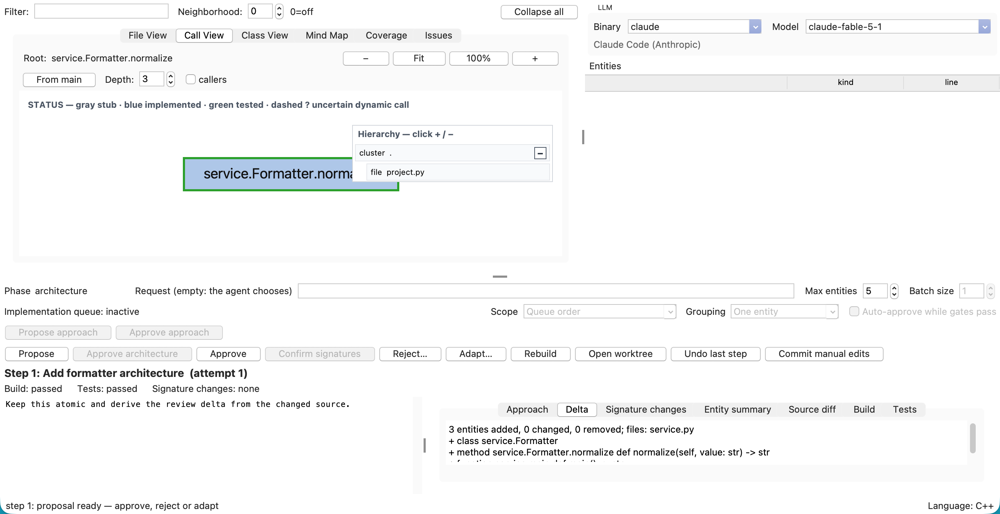

*A live architecture proposal exposes both the structural change and its gate status before approval.*

### Review a proposal

The lower panel contains:

- the provider rationale and questions;
- **Delta**: added, removed, changed, and renamed entities;
- **Signatures**: previous and proposed declarations;
- **Summary**: editable structured intent for adaptation;
- **Diff**: the exact candidate patch;
- **Build** and **Tests**: captured gate output.

Review the source diff and the resulting diagrams, not only the rationale. Build and test success prove the configured
checks passed; they do not prove the change meets the specification.

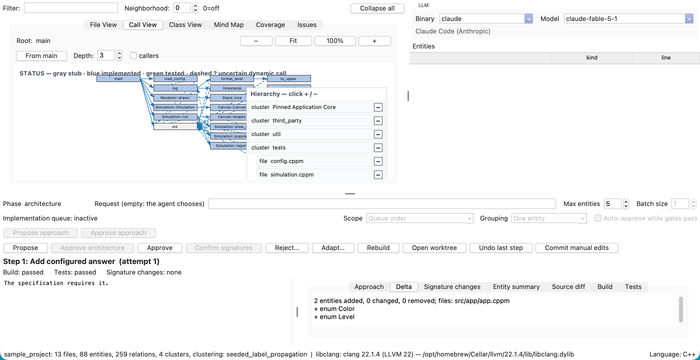

*Delta summarizes the model-level effect rather than forcing reviewers to infer it from text.*

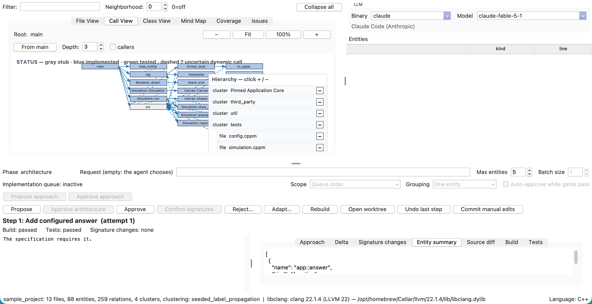

*The Summary tab provides structured intent that can be edited and returned as hard adaptation constraints.*

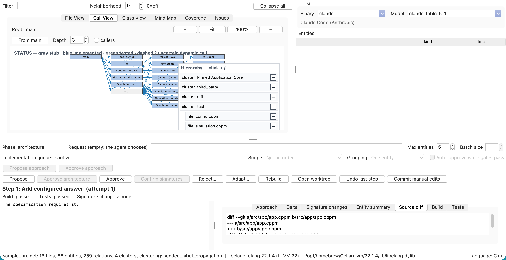

*The Diff tab remains the authoritative view of what the proposal would actually change.*

### Decide

- **Approve** promotes the worktree changes, rebuilds and retests the real project, appends the step record, and
  creates one Git commit.
- **Reject...** records a reason. The next proposal receives that reason as feedback.
- **Adapt...** uses edits made in the Summary tab as hard constraints. If the summary is unchanged, ICODA asks
  for a semicolon-separated free-text instruction.
- **More... > Open worktree** opens the proposal checkout for manual inspection or editing.
- **More... > Rebuild** reruns build, tests, parsing, and delta computation after a manual worktree edit.

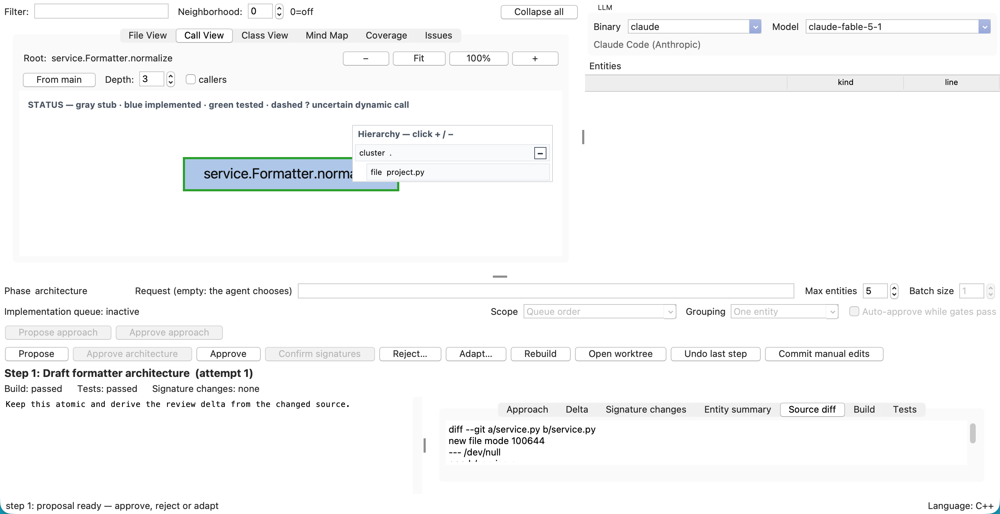

*Rejection is a recorded decision; its reason becomes feedback for the next attempt.*

If an existing entity signature changes, **Approve** remains disabled until **Confirm signatures** is pressed.
Confirmation applies only to the proposal currently displayed and is not persisted as a general permission.


*An API change receives its own gate even when build and tests already pass.*

### Finish architecture

When the skeleton is adequate and no live proposal is waiting for a decision, press **Approve architecture**. After
confirmation, ICODA records the phase transition, constructs the implementation queue, reloads the project, and
enables the implementation controls.

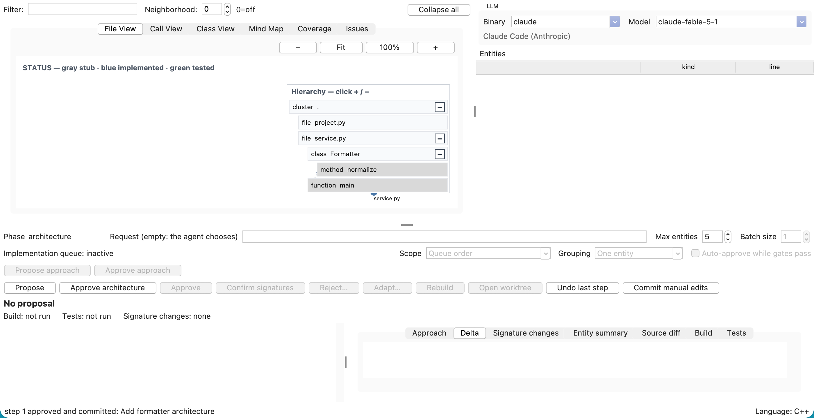

*Approving architecture is an explicit phase gate, not an incidental result of approving one proposal.*

## 8. Implementation workflow

Implementation targets functions that are stubs or have no definition. ICODA builds a deterministic, persisted
bottom-up queue: callees are implemented before callers. Recursive call cycles are treated as one component with a
stable name/signature/file ordering.

### Choose the next target

The queue row shows the current target or batch and the number of remaining callables. To override the head, right-
click a pending callable and choose **Implement this function**. The override is persisted and becomes the next
two-round implementation target.

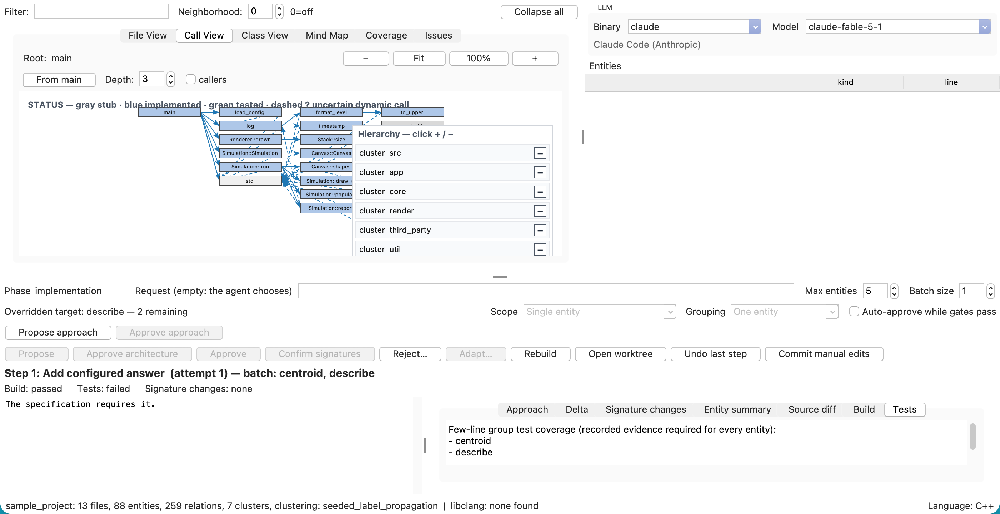

*A target override changes the next review unit without discarding the deterministic queue.*

**Scope** controls which remaining targets are eligible:

| Scope | Meaning |
|---|---|
| Queue order | Continue through the persisted bottom-up order. |
| Single entity | Limit the next selection to the current target. |
| Enclosing class | Bring remaining callables of the current class together. |
| Enclosing cluster | Bring remaining callables of the current dependency cluster together. |
| All remaining leaves | Select remaining call-graph leaves before their callers. |

Changing scope reorders the relevant queue tail and invalidates an already approved approach.

**Batch size** is the maximum ordinary queue batch. A later candidate joins only when it has no unimplemented
dependency outside the candidate batch. Keep it at `1` for the smallest possible review unit.

**Grouping** has two modes:

- `One entity` uses the ordinary queue/batch path. With Batch size greater than one, an ordinary batch can still
  contain multiple entities; use Batch size `1` for a literal one-entity step.
- `Few-line group` deliberately combines an adjacent getter/setter family or overload set only when all members are
  in one file and enclosing class, each fits `max_function_lines`, and the total fits
  `hard_max_function_lines`. The queue row shows the exact refusal when grouping is unsafe.

Few-line grouping also requires successful recorded test evidence for every member before approval.

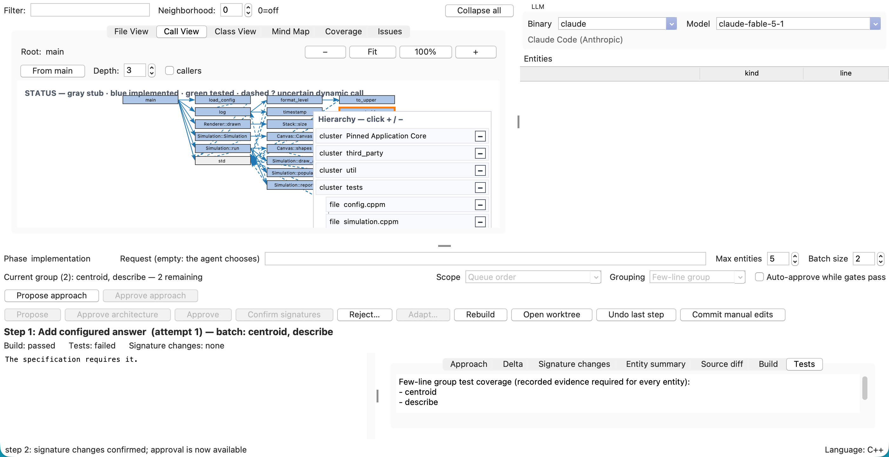

*Grouping is visible as a bounded batch and adds an explicit evidence requirement for every member.*

### Round 1: approve the approach

1. Press **Propose approach**.
2. Review the prose plan, expected entities, and expected files in the **Approach** tab.
3. Press **Approve approach**, **Reject...**, or **Adapt...**.

An approved approach is persisted for the current queue batch. Changing the target, scope, batch size, or grouping
invalidates it. The approach round does not modify source files.


*The first round presents a prose plan, expected entities, and expected files before any code is generated.*

### Round 2: approve code and tests

1. Press **Propose** after approving the approach.
2. Inspect the delta, structured entity summary, source diff, Build output, and Tests output.
3. Confirm signature changes if present.
4. Approve, reject, adapt, or edit/rebuild the worktree.

On approval, ICODA repeats build and tests in the real project before committing. It advances the queue cursor only
after all gates pass and the commit path succeeds. The approved approach is then cleared for the next target.

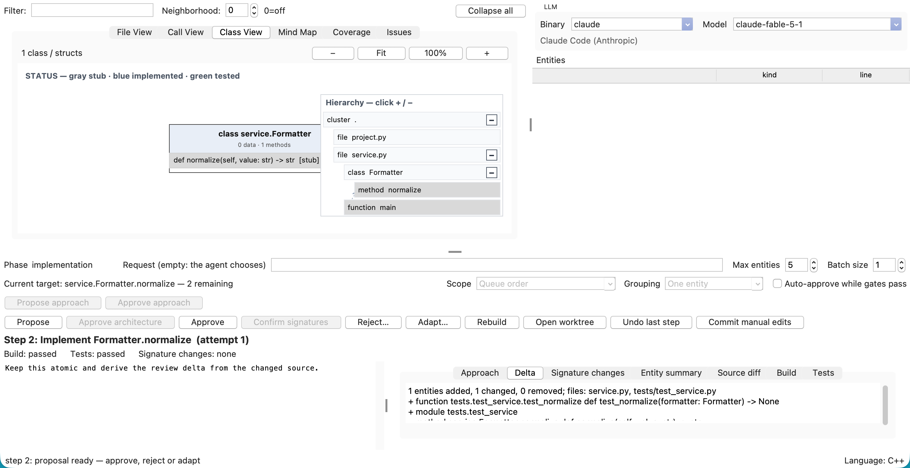

*The second round makes source, tests, model delta, and gate results reviewable together.*

### Automatic approval

**Auto-approve while gates pass** defaults off. When enabled, it can approve only a live implementation code
proposal whose build and tests pass. It never automatically approves:

- architecture steps;
- implementation approaches;
- historical records;
- failed or missing build/test gates;
- unconfirmed signature changes.

After automatically approving code, ICODA proposes the next approach and stops for the developer's decision. If
that approach is approved while auto-approve remains enabled, ICODA starts the code round and can approve the green
result. When automatic approval cannot continue, the proposal stays as it is and the hint line above the buttons
says `Auto-approve paused: <reason>. Decide yourself.`; the status bar repeats the reason.

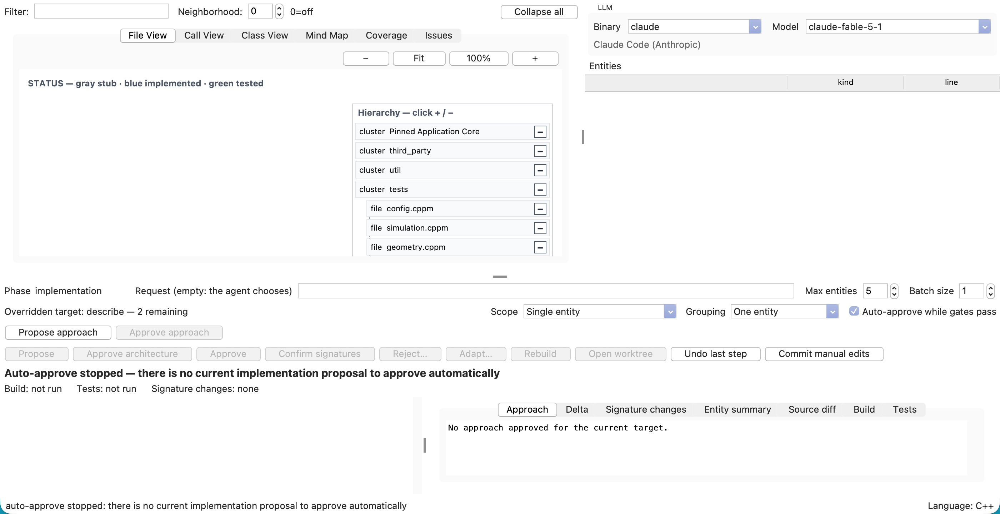

*Automatic approval is deliberately state-aware and reports why it will not proceed.*

## 9. Build and test gates

Build and test results are separate. A successful build cannot compensate for failed, absent, or unconfigured tests.

For C++ projects, the default proposal gates are:

```bash
cmake --preset debug
cmake --build --preset debug
ctest --preset debug
```

The identifier is `steps.CMAKE_PRESET`, currently `"debug"`. Both `gate_commands` and the direct fallback in
`_build_commands` configure with `cmake --preset debug` and build with `cmake --build --preset debug`; when a
generated `build.sh` or `build.cmd` is used by `_build_commands`, it receives `debug build-only`. The configured
test command remains a separate gate.

For generated projects, `build.sh debug build-only` or `build.cmd debug build-only` provides the separate build-only
contract, while running those scripts without `build-only` also invokes CTest for manual use.

For Python projects, the build gate byte-compiles `src/`, and the test gate uses the Code Profile's **Test runner**.
Targeted test identifiers are appended when ICODA can associate tests with the selected functions.

Test selection uses explicit model associations and successful step-log provenance. The Tests tab says whether a
focused subset or the full suite ran. Test output is retained with the step; the structural index marks a callable
reached only when a successful recorded test identifier can reach it through analysed call edges.

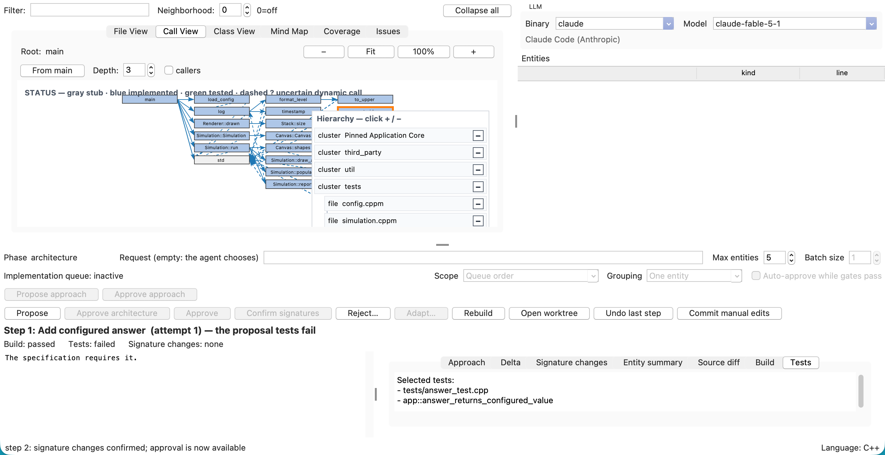

*A failed test gate remains visible with the exact focused tests; build success cannot make the proposal approvable.*

Proposal build and test processes have a 15-minute timeout. Displayed output is limited to the final 6,000
characters so a failing process cannot flood the GUI or step log.

The C++ test command defaults to `ctest --preset debug` in `.icoda/state.json`. There is currently no GUI editor for
that field. Change `test_command` only with ICODA closed, preserve it as a JSON array of command arguments, and
reopen the project.

## Worked examples

These examples begin in the repository's `icoda` directory with an authenticated `codex` or `claude` command.
Provider prose and titles vary, but the commands, GUI labels, gates, and quoted status text below are deterministic.

### Worked example A: new Python project from first launch to approval

This run creates a disposable formatter project, takes it through analysis and architecture, and approves one
implementation step.

1. Prepare the pinned installation and an empty project directory:

   ```bash
   cd /absolute/path/to/repository/icoda
   python3 -m venv .icoda-venv
   .icoda-venv/bin/python -m pip install -e '.[dev]' -c constraints.txt
   project_dir="$(mktemp -d /tmp/icoda-formatter.XXXXXX)"
   printf '%s\n' "$project_dir"
   ./icoda.bash
   ```

   The terminal prints the directory to select, then the main window opens. Before a project is selected the status
   line is `No project open`, and the hint starts `Open a project (File ▸ Open Project…)`.

2. In **LLM**, set **Binary** to the authenticated `codex` or `claude` command and choose a **Model**. Choose
   **File ▸ New Project…**, select the printed empty directory, and observe the status
   `New project <directory-name>: write the specification and save it` and the Specification window.

3. Enter these exact values, using **Add** after the use case, each requirement, and the decision:

   - **Overview** — Title: `Formatter`; Description: `Normalize one line of text.`
   - **Scope** — Goals: `trim leading and trailing whitespace`; Not in scope: `file input`; Not allowed:
     `third-party packages`; Done when: `normalize has a passing unit test`.
   - **Use cases** — Title: `Normalize a line`; Details: `Return a line without surrounding whitespace.` The list
     assigns `UC-1`.
   - **Requirements** — `normalize removes surrounding whitespace`, priority `must`, use case `UC-1`; and
     `normalize has a unit test`, priority `must`, use case `UC-1`. The list assigns `R-1` and `R-2`.
   - **Decisions** — Title: `Standard library only`; Rationale: `No dependency is needed.`
   - **Code profile** — choose Language `Python`; keep Test runner `python -m pytest`, Max function lines `30`, and
     Hard max function lines `50`.

4. Press **Validate**. The message beside the buttons is exactly `valid`. Press **Save**. The message becomes
   `saved`, and the confirmation begins `Specification saved and the project skeleton written (5 files).` Press
   **Yes** at `Build it now?`. The status temporarily reads `build passed — analysing the project …`; after analysis,
   the **File View** contains `src/formatter.py` and `tests/test_formatter.py`, and the phase label is `architecture`.

5. In **Request**, type `Add a stub normalize(value: str) -> str method to Formatter and its test shape; do not
   implement the method.` Press **Propose**. The hint successively reports `Working: asking the agent for the next
   step.`, `step 1: building the proposal`, `step 1: testing the proposal`, and `step 1: parsing the proposal`.
   Review **Delta**, **Diff**, **Build**, and **Tests**. A usable result shows `Build: passed` and `Tests: passed`;
   its `normalize` body is a stub. If the title says `no usable proposal`, use the named error in **Adapt…** and
   repeat until those two gate labels pass.

6. Press **Approve**. ICODA promotes the isolated worktree, rebuilds and retests the real project, records the step,
   creates an `icoda(architecture) step 1: ...` commit, and refreshes the diagrams. Press **Approve architecture**,
   then **Yes** at `Approve the architecture and begin implementation?`. The phase label becomes `implementation`,
   and the queue line starts `Current target:` and ends `— 1 remaining` for the new stub.

7. Press **Propose approach**. In **Approach**, require `return value.strip()` and a pytest test for padded and clean
   strings; use **Adapt…** if needed. A usable plan starts `Awaiting developer approval`. Press **Approve approach**;
   it changes to `Approved`, and the hint ends `Press Propose to get the code and its tests.`

8. Press **Propose**. Inspect the implementation and test, then require `Build: passed` and `Tests: passed`. Press
   **Approve**. The approved code is in the project and Git history; after the last stub is completed the queue reads
   `Implementation queue: empty — no unimplemented functions`. The **Coverage** view reports recorded test
   reachability: it projects successful recorded test identifiers through analysed calls and is not runtime or
   branch coverage.

### Worked example B: split a Python function refused by the 50-line gate

This example deliberately requests an oversized implementation so the proposal-time gate is visible, then accepts
the split version. Use another empty directory and start ICODA:

```bash
cd /absolute/path/to/repository/icoda
project_dir="$(mktemp -d /tmp/icoda-line-gate.XXXXXX)"
printf '%s\n' "$project_dir"
./icoda.bash
```

1. Choose **File ▸ New Project…** and the printed directory. Create a Python specification titled `Line Gate` with
   goal `classify input lines`, one use case `Classify a line`, requirement `classify returns a category for every
   input`, and done condition `classification tests pass`. Keep Hard max function lines `50`; press **Validate**,
   **Save**, and **Yes**. Observe `valid`, then `saved`, then `build passed — analysing the project …` and phase
   `architecture`.

2. Request `Add a stub classify(value: str) -> str method to LineGate.` Press **Propose**, require `Build: passed`
   and `Tests: passed`, then **Approve**. Press **Approve architecture** and confirm. The phase becomes
   `implementation`, with `LineGate.classify` in `Current target:`.

3. Press **Propose approach** and request one deliberately long implementation: `For this gate exercise, make
   classify exactly 51 source lines including its def line, with repeated explicit branches, plus a passing test.`
   Press **Approve approach**, then **Propose**. ICODA may retry the provider up to three times, feeding the same
   deterministic rule error back. The rejected proposal title ends with the exact refusal form:

   > `LineGate.classify is 51 lines; split it below the hard maximum of 50.`

   **Approve** stays grey. This is proposal-time enforcement by `_quality_refusal`, not an Issues warning. If the
   provider pre-emptively splits the function, use **Adapt…** to reiterate the 51-line exercise; do not approve it.

4. Press **Adapt…** and enter `Split classify into small private helpers; keep classify and every helper at or below
   50 source lines, preserve the approved behavior, and test the public method.` Press **Propose** if the adapted
   response is not started automatically. The accepted candidate shows no `hard maximum of 50` error and shows
   `Build: passed` and `Tests: passed`.

5. Review the helper signatures and **Diff**, press **Confirm signatures** if that button appears, then press
   **Approve**. Approval invokes `_quality_refusal` again against the candidate model before promotion; passing that
   second check, rebuild, and tests creates the implementation commit. The hard 50-line function limit therefore
   blocks both proposal time and approval time, while the split version completes the same queue target.

### Worked example C: CMake/C++ with `CMAKE_PRESET`

This run uses the generated C++20-module skeleton and the exact `steps.CMAKE_PRESET` build path.

```bash
cd /absolute/path/to/repository/icoda
project_dir="$(mktemp -d /tmp/icoda-cmake-preset.XXXXXX)"
printf '%s\n' "$project_dir"
./icoda.bash
```

1. Choose **File ▸ New Project…** and the printed directory. Enter title `Preset Counter`, goal `increment a
   counter`, one use case `Increment once`, requirement `increment returns the next value`, and done condition
   `CTest passes`. Keep Code profile Language `C++`, C++20 modules enabled, and Test runner
   `ctest --preset debug`. Press **Validate**, **Save**, and **Yes**. The confirmation says the skeleton wrote
   `11 files`.

2. **Project ▸ Build** calls the C++ gate selected by `CMAKE_PRESET = "debug"`:

   ```text
   cmake --preset debug
   cmake --build --preset debug
   ```

   Success briefly shows `build passed — analysing the project …`. The generated preset writes
   `build/debug/compile_commands.json`; after analysis, **File View** contains `src/main.cpp` and
   `src/app/app.cppm`. Failure instead shows `build failed — the output is in the step panel`; use the exact remedy
   in [Troubleshooting](docs/TROUBLESHOOTING.md), then choose **Project ▸ Build** again.

3. Request `Add a stub app::increment(int value) function and a CTest smoke assertion; do not implement the
   function.` Press **Propose**. The proposal repeats the configure and build commands above and then runs the
   separately configured `ctest --preset debug` test gate. Require `Build: passed` and `Tests: passed`, inspect the
   module diff, and press **Approve**. The project rebuild repeats those gates before the architecture commit.

4. To observe the same generated project independently, close no windows and type in another terminal:

   ```bash
   cd "$project_dir"
   cmake --preset debug
   cmake --build --preset debug
   ctest --preset debug
   ```

   CMake ends the configure with `Build files have been written to: .../build/debug`, the build exits successfully,
   and CTest ends with `100% tests passed, 0 tests failed out of 1`. Those are the configure, build, and test stages
   ICODA gates separately; the preset name is not inferred from the directory.

## 10. Git, persistence, and recovery

### Project files

| Path | Purpose | Normally committed? |
|---|---|---|
| `.icoda/specification.json` | Formal project specification | Yes |
| `.icoda/state.json` | Phase, queue, cursor, approach, scope, grouping, and auto-approve state | Yes |
| `.icoda/steps.jsonl` | Append-only development and decision history | Yes |
| `.icoda/layout.json` | Cluster names and pins | Yes |
| `.icoda/cache/model.json` | Derived analysis cache | No |
| `.icoda/ui.json` | Per-project provider and UI choices | No |
| `.icoda/icoda.log` | Analysis and GUI diagnostic log | No |
| `.icoda/worktree/` | Isolated live proposal checkout | No |

The generated `.icoda/.gitignore` ignores `cache/` and `ui.json`; step preparation also ignores `worktree/` and
`icoda.log`.

### Manual edits

ICODA refuses to start a later proposal while ordinary uncommitted project files exist. Choose **Project > Commit
Manual Edits** to analyse those edits, record them as a manual step, and commit them. If proposal startup detects a
dirty tree, the GUI offers this path directly.

### Undo

**Undo last step** creates a Git revert commit for the most recent approved ICODA step. The confirmation names the
step that goes and says what happens: the files return to the state before that step, nothing is deleted from the
Git history or the step log. It works only when the working tree is clean and `HEAD` is still that step's commit.
ICODA will not rewrite unrelated later history; use Git manually when those conditions no longer hold.

### Interrupted proposals

A leftover `.icoda/worktree` is preserved and reported when a project is reopened. Inspect it before proposing
again if it contains work worth keeping. Starting a fresh proposal resets or recreates the proposal worktree from
the current `HEAD`.

### Corrupt state

Invalid JSON in `.icoda/state.json` is refused rather than silently replaced with defaults. The error is shown in
the application and logged, and an existing proposal worktree is preserved. Repair or restore the state file from
version control before continuing.

State saves use `persistence._atomic_write_text`: a flushed and synced temporary file beside `state.json` is
atomically replaced into place, followed by a best-effort directory sync. If replacement fails, the original
`state.json` stays intact. The accepted limitation is narrow: if cleanup is also denied, the replacement error is
still reported and one orphaned `.state.json.*.tmp` file can remain beside that intact original; remove the orphan
after correcting permissions.

### User configuration

Global defaults and recent projects are stored at:

- macOS: `~/Library/Application Support/ICODA/config.json`
- Linux: `${XDG_CONFIG_HOME:-~/.config}/icoda/config.json`
- Windows: `%APPDATA%\ICODA\config.json`

The `editor` value may be a command template containing `{file}` and `{line}`. Without one, ICODA uses VS Code when
`code` is on `PATH`, then falls back to the operating system's default opener.

## 11. Troubleshooting

### The model is empty or stale

For C++, build the project (**Project > Build**) and confirm a current `compile_commands.json` exists. Open
**Project > Choose libclang Library...**, select a detected candidate and press **Apply**: the choice is saved and
the open project is reloaded, and because every analysis runs in a fresh child process the new library is used at
once. The chooser distinguishes the saved active choice from the library the last analysis actually loaded.

If libclang is unavailable or parsing crashes, ICODA keeps the last derived model and marks it stale. Details and
the last parsed unit are in `.icoda/icoda.log`.

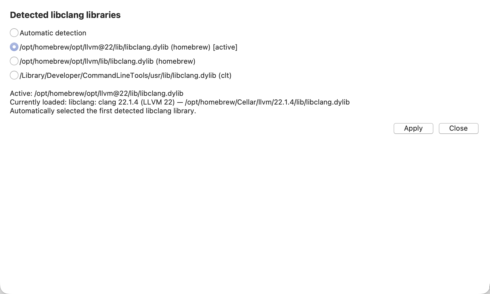

*The chooser makes toolchain discovery explicit and separates the saved selection from the library last loaded.*

For Python, syntax-invalid files remain visible with parse errors but contribute no entities or call relations until
fixed.

### C++ modules do not build

Check all of the following:

- CMake is at least 3.28.
- The selected Clang is module-capable and is accompanied by `clang-scan-deps`.
- `CC` and `CXX` point to matching compiler binaries.
- On macOS, Homebrew LLVM is installed or explicitly selected.
- A build cache copied from another checkout has been removed.

Generated build scripts detect a mismatched `CMAKE_HOME_DIRECTORY` and replace that preset's stale cache.

### A proposal action is disabled

Rest the pointer on the grey button: its tooltip ends with `Grey now: <reason>`. The reasons are:

- In `specification`, save a valid specification first (no step buttons are shown).
- In `architecture`, **Propose** is available; approach and queue controls are not.
- **Approve architecture** requires no live proposal.
- In `implementation`, approve an approach before requesting code.
- **Approve** requires a usable proposal with passing build and tests.
- Signature changes require **Confirm signatures**.
- **Adapt** requires a usable live structured proposal or an unapproved approach.
- Historical records are review-only.
- While a step runs, every button waits; **Cancel** stops the cancellable parts.

### The window does not answer

Slow work runs in the background and shows a moving bar with the activity. If the window itself stops answering for
more than five seconds, a watchdog thread writes every thread's stack to `.icoda/icoda.log` (lines starting with
`watchdog:`); that block identifies the blocked call. `docs/TROUBLESHOOTING.md` explains what to send.

### Provider invocation fails

Run provider qualification, confirm the binary is on `PATH`, authenticate it interactively, and verify the model ID
is accepted by the installed CLI version. A typed full path must still have a basename matching a configured
provider command. Provider stderr and the final error appear in the review panel.

### Build passes but approval is unavailable

Open the Tests tab. Tests must report `passed`, not `not run`. Confirm the test runner exists in the environment and
the test command is valid. For a few-line group, every member also needs reachable recorded test evidence.

### External edits are not reflected

Return focus to ICODA or choose **File > Reload**. ICODA snapshots analysed source files and reloads when the window
regains focus after a real source change. A changed body can demote a previously tested entity to implemented until
tests establish fresh evidence.

### Analysis or GUI failure

Read `.icoda/icoda.log` first. For verification failures, open the newest directory named by
`.icoda-test-artifacts/LATEST`, then inspect `summary.txt`, the failing check's `.log`, `environment.json`, and the
captured screenshots.

## 12. Maintainer guide

### Code map

| Area | Main files |
|---|---|
| Desktop shell and File View | `icoda.py` |
| Larger Tk widgets | `icoda_gui/` |
| Specification | `icoda_core/specification.py`, `specification.schema.json`, `icoda_gui/spec_editor.py` |
| Analysis and model | `icoda_core/analysis.py`, `python_analysis.py`, `model.py`, `session.py` |
| Views and graph behavior | `views.py`, `class_view.py`, `mind_map.py`, `graph_filter.py`, `expansion.py` |
| Workflow and gates | `steps.py`, `phases.py`, `implementation_queue.py`, `grouping.py`, `auto_approve.py` |
| History and reachability | `steplog.py`, `coverage_index.py`, `requirement_coverage.py`, `rules.py` |
| Provider integration | `agent.py`, `providers.json`, `provider_check.py` |
| Persistence and Git | `persistence.py`, `git.py` |

Keep non-GUI decisions in `icoda_core` whenever possible. Tk widgets should render core results and dispatch explicit
actions rather than reimplementing queue, reachability, rule, or phase logic.

### Required verification after every change

Run the complete project gate:

```bash
./verify.bash
```

On Windows:

```bat
verify.cmd
```

The verifier runs all checks even after one fails and retains evidence for each, in this exact order:

1. `git diff --check`
2. Ruff (`python -m ruff check .`)
3. mypy over the application, core, GUI, verifier, GUI acceptance, and real-provider acceptance
4. Python byte compilation
5. local provider qualification
6. real-provider acceptance (`tests/real_provider_acceptance.py`)
7. C++ sample configure, build, and CTest
8. pytest with branch coverage, JUnit XML, and `--cov-fail-under=85`
9. fresh sample-project analysis
10. real-Tk GUI acceptance with validated screenshots

The real-provider stage is fail-closed when no authenticated Codex CLI session is available. A deliberate
`./verify.bash --allow-missing-real-provider` run records that stage as `SKIP`; it does not silently omit it.

Each run creates `.icoda-test-artifacts/<timestamp>/` with command logs, `summary.json`, `summary.txt`,
`environment.json`, provider qualification, JUnit, XML/HTML coverage, the sample ICODA log, GUI state, and PNG
captures. `.icoda-test-artifacts/LATEST` names the newest directory.

Do not treat a screenshot's existence as visual verification. The acceptance script checks dimensions, colour
variation, visible controls, and graph content; maintainers should also inspect captures affected by a GUI change
for clipping, overlap, unreadable labels, incorrect state, and stale output.

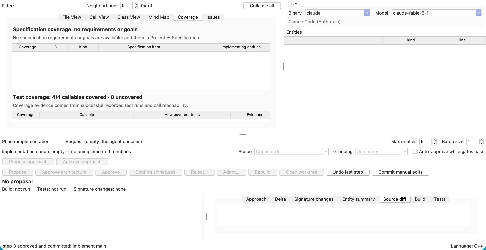

*The deterministic lifecycle ends only after the queue is empty and recorded test identifiers reach every callable.*

### Focused acceptance scripts

Run the GUI suite directly when changing views, controls, interaction, or rendering:

```bash
.icoda-venv/bin/python tests/gui_acceptance.py \
  --project tests/sample_project \
  --output .icoda-test-artifacts/gui-manual
```

Run the deterministic full lifecycle when changing phase, proposal, queue, approval, or persistence behavior. The
project directory must be absent or empty:

```bash
.icoda-venv/bin/python tests/simulation_acceptance.py \
  --project .icoda-test-artifacts/simulation-project \
  --output .icoda-test-artifacts/simulation-manual
```

Run the retained large-project benchmark when changing analysis, layout, expansion, or reachability algorithms:

```bash
.icoda-venv/bin/python tests/performance_acceptance.py \
  --output .icoda-test-artifacts/performance-manual
```

These GUI scripts require a real display. The standard verifier uses `xvfb-run` automatically on headless Linux
when it is available.

### Real-provider acceptance

Real-provider acceptance consumes model usage and is the sixth `verify.bash` stage. Run it directly only when a
provider, prompt, response, or end-to-end generation contract needs focused qualification, and always use a new
output directory:

```bash
.icoda-venv/bin/python tests/real_provider_acceptance.py \
  --provider codex \
  --model gpt-5.6-sol \
  --output .icoda-test-artifacts/real-provider-codex-YYYYMMDD-HHMMSS
```

It retains the prompt, provider command, stdout/stderr, parsed response, source diff, build/test results, model
facts, step records, Git history, approval, undo, and final clean-tree checks.

### Documentation and release evidence

- `docs/GAP_ANALYSIS.md` is the feature-to-evidence inventory.
- `docs/SIMULATION.md` records the complete developer-controlled lifecycle.
- `docs/RELEASE_MATRIX.md` records only platform behavior actually executed.
- `docs/VERIFY_LOG.md` is the detailed chronological verification record.

Do not upgrade a platform or feature status based on inference. Preserve exact commands, outputs, screenshots, and
environment metadata that support the claim.

## 13. Current limitations

The current implementation has the following important boundaries:

- The specification editor validates a supplied formal specification but does not yet guide the developer through
  an AI-assisted discovery and choice process.
- Specification traceability is shown in the Coverage table; the all-diagram colour mode represents structural
  recorded test reachability, not specification-tag traceability or verified behavior.
- Most Code Profile and rule-check findings are advisory rather than approval-blocking.
- C++ proposal gates assume the `debug` CMake build and test presets.
- Only Claude Code and Codex CLI are enabled in the shipped provider registry. Other provider templates are present
  but intentionally unqualified; the Binary field's tooltip names them.
- The release matrix qualifies Linux with the full verification gate. macOS has a hands-on usage record without a
  gate run; Windows launcher and platform paths exist but are unmeasured.
- Retained large-project measurements name non-blocking scaling defects in Python parsing, File View layout, and
  expansion derivation. Consult `docs/GAP_ANALYSIS.md` before making performance claims.

## 14. Command reference

The **Project > Build** menu entry runs the same build gate as a proposal (`cmake --preset debug` and `cmake --build
--preset debug` for C++, `python -m compileall -q src` for Python) and reloads the analysis when it passes.
**Project > Test Command...** edits the test command kept in `.icoda/state.json` (default `ctest --preset debug`).

```bash
# Start the GUI
./icoda.bash [project-directory]

# Install contributor dependencies
.icoda-venv/bin/python -m pip install -e '.[dev]' -c constraints.txt

# Run the complete verification gate
./verify.bash

# Qualify local provider CLIs without model usage
.icoda-venv/bin/python -m icoda_core.provider_check \
  --output .icoda-test-artifacts/provider-qualification.json

# Analyse a project in the same child-process path used by the GUI
.icoda-venv/bin/python -m icoda_core.session /absolute/path/to/project

# Build and test a generated C++ project
./build.sh debug

# Build a generated C++ project without the script's CTest stage
./build.sh debug build-only
```

Windows equivalents use `icoda.cmd`, `verify.cmd`, `.icoda-venv\Scripts\python.exe`, and `build.cmd`.

## 15. Glossary

**Approach**: the prose-only first round for an implementation target or batch.

**Derived model**: ICODA's parsed representation of files, entities, relations, status, documentation, and test
associations.

**Entity**: a parsed namespace, type, function, method, field, variable, alias, or related source construct.

**Gate**: a condition that must pass before approval, especially build, tests, delta validation, phase consistency,
signature confirmation, and grouped-step recorded test reachability.

**Implementation queue**: the persisted bottom-up order of remaining stub or undefined callables.

**Proposal**: a structured provider response applied and verified in the isolated worktree.

**Step record**: one JSON Lines history entry describing a phase transition, approach decision, approved/rejected
proposal, manual edit, or undo.

**USR**: a stable entity identifier used by the derived model and implementation queue.

**Worktree**: `.icoda/worktree`, the detached Git checkout in which a live proposal is applied and tested before it
can affect the project working tree.
