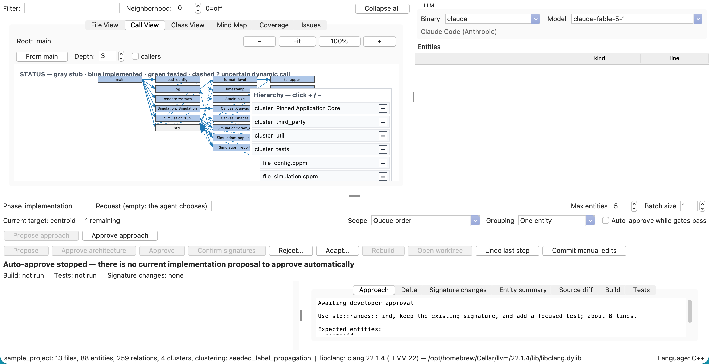

# ICODA

**Interactive Code Development and Analysis** is a desktop application for developing C++ and Python software
with coding agents in small, reviewable steps. Write a specification, develop the architecture, and implement
functions while inspecting the source structure, proposed changes, and test evidence in one place.

You decide what to build, approve implementation approaches, and review code before it is committed. ICODA
derives its architecture views from the source code and verifies proposals in an isolated Git worktree.

**Users** start with [Getting started](docs/GETTING_STARTED.md) (two pages: install, first project, first step),
then the [Tutorial](docs/TUTORIAL.md) (the complete C++ Score Clamp example) and
[Troubleshooting](docs/TROUBLESHOOTING.md). The [Handbook](HANDBOOK.md) is the complete reference. Inside ICODA,
the **Help** menu opens the same pages, and the sentence above the buttons in the lower panel says what to do next.

**Maintainers** read [Development](#development) below and the handbook's
[maintainer guide](HANDBOOK.md#12-maintainer-guide).



*The implementation workspace combines the project structure, next target, and approach awaiting approval.*

## What ICODA Does

- **Formal specifications:** record goals, exclusions, use cases, requirements, architectural decisions, and a
  Code Profile with language, library, style, and test conventions.
- **Source analysis:** inspect files, calls, classes, and a hierarchical Mind Map. Filter, zoom, pan, and follow
  entities back to their source locations.
- **Source editor:** click a file, class, or function to open its source in the upper-right **Source Editor** tab.
  Clicking keeps the current right-hand tab selected; select **Source Editor** when you want to view or edit
  the source, or double-click an entity in **Entities** to switch to its source line in the editor.
  **Entities** shows the clicked class and its members, or just the clicked function. Clicking a file shows
  all entities in that file. Call View selections also use the correct source when reviewing a proposal.
  Edit, save, undo/redo, and find/replace text without leaving ICODA. Saving refreshes project analysis;
  candidate worktree edits require a rebuild before approval.
- **Controlled generation:** review architecture proposals, then approve an implementation approach before
  requesting code and tests. Work through a persisted queue or select the next target yourself.
- **Build and test gates:** keep approval blocked when a proposal fails its configured checks. Review the source
  diff, entity changes, API signature changes, and build/test output before deciding.
- **Traceability:** connect requirements to code through `@satisfies` tags and inspect recorded test evidence,
  callables not structurally reached by recorded test identifiers, advisory rule findings, and development history.
- **Git integration:** approve changes as commits, record manual edits, or revert the last approved step when
  its undo conditions are satisfied.

ICODA is independent of [AI-Loop](../ai-loop/README.md), the unattended job runner in the same repository.
It does not require AI-Loop or Redis.

## Quick Start

The short version; [Getting started](docs/GETTING_STARTED.md) has the walkthrough.

### Prerequisites

| Task | Requirements |
|---|---|
| Run the desktop application | Python 3.10 or newer with Tkinter, Git, and a graphical desktop |
| Generate proposals | An installed and authenticated Claude Code or Codex CLI |
| Analyse C++ | A compatible libclang and a generated `compile_commands.json` |
| Build and test C++ | CMake 3.28 or newer, Ninja, Clang, and the project's dependencies; `clang-scan-deps` for C++ modules |
| Build and test Python | The project's dependencies and its configured test runner, such as pytest |

Install vcpkg and set `VCPKG_ROOT` when the C++ project requires it. On macOS, generated C++ module projects
normally need Homebrew LLVM; Apple Clang alone may not provide the required module-scanning support.
See the [installation guide](HANDBOOK.md#2-installation-and-launch) for details.

### Launch

From the root of this repository, on macOS or Linux:

```bash
cd icoda
./icoda.bash
```

On Windows, in Command Prompt:

```bat
cd icoda
icoda.cmd
```

To open a project immediately, pass its absolute path from the `icoda/` directory:

```bash
./icoda.bash /absolute/path/to/project
```

```bat
icoda.cmd "C:\path\to\project"
```

The launchers only validate Python, Tkinter, required system tools, and an already prepared `.icoda-venv` before
starting ICODA; they never create the environment or install or upgrade packages. The virtual environment keeps
ICODA's packages separate from other Python projects, and manual activation is not required. Follow
[Getting started](docs/GETTING_STARTED.md#1-install) to create it and install the pinned dependencies explicitly.

### Create or Open a Project

For a new project, choose **File > New Project...**, select an empty directory, and complete the Specification
editor. Select the language in **Code Profile**, validate the specification, and save. ICODA creates missing
skeleton files, moves into the architecture phase, and offers to build the skeleton; **Project > Build** does the
same at any later time and reloads the analysis when the build passes.

For an existing project, start from a committed working tree and choose **File > Open Project...**. Python source
is analysed without importing or executing it. C++ analysis needs the compiler settings in `compile_commands.json`.
If the CMake project already has a configured build under `build/`, press **Build**, even when the target list is
empty. ICODA reuses that build's settings, exports the compiler commands, builds, and reloads the analysis.
**Refresh targets** also exports compiler commands and reloads an empty analysis after configuration succeeds.
Build uses Clang with `clang-scan-deps` on Windows, macOS and Linux. It reuses an existing Clang configuration;
when the project uses another compiler, it creates `build/debug-clang` with Ninja and carries over the project
and dependency options. The original build tree is retained. On Windows it initializes the Visual Studio SDK
environment automatically. If Clang is unavailable, Build reports how to install it instead of using another compiler.

If no build has been configured, configure the project using its own instructions first. For a CMake project
with a `debug` preset and a Ninja or Makefiles generator, run these commands in that project:

```bash
cmake --preset debug -DCMAKE_EXPORT_COMPILE_COMMANDS=ON
cmake --build --preset debug
```

ICODA looks for the newest compile database at the project root, in `build/`, or one directory below `build/`,
such as `build/debug/`. Reload after generating it. Use **Project > Choose libclang Library...** if library
discovery needs adjustment; applying a choice reloads the open project with that library.
CMake commands for sources outside the project (including the compiler's standard-library modules) are excluded
from the project model. Installed `vcpkg_installed/` headers are shown as external dependencies, even when that
directory sits inside the project.

Projects with several targets initially show **Whole project**, so File and Class diagrams are visible as soon
as analysis finishes. Choose an executable or library to focus the views, or choose **Whole project** to return
to the overview. The choice is saved per project. Build works in the overview; Run requires an executable.
The diagram filter `namespace:vve` matches that namespace only; `namespace:vve::*` also includes child namespaces.
Class members use their class's namespace.

Entity tooltips include a **Purpose** sentence from the source documentation, along with the existing source,
signature, status, requirements, and test information. After opening or reloading a project, ICODA automatically
asks the selected CLI LLM to add missing purpose comments throughout the analysed project. It preserves existing
comments and requests documentation changes only. It then reanalyses the source to verify coverage, retries
incomplete work once, and reports remaining work in Prompt. The startup LLM job runs independently in the background:
you can continue navigating, editing, building, and using Prompt. It edits a temporary source copy and applies
documentation changes only when the workflow is idle, no proposal is awaiting review, and the editor has no
unsaved changes. Files changed meanwhile are left untouched. Cancelling a foreground task does not cancel the
comment job; Prompt's Cancel button stops the comment job when no conversation is running. New proposals cannot
be approved while an entity in an affected source file lacks a purpose
comment. C++ uses Doxygen comments; Python uses docstrings.

Existing CMake projects without ICODA state start in the implementation phase. Existing Python projects without
ICODA state start in the specification phase; saving their first specification may add missing skeleton files.
See [Starting a project](HANDBOOK.md#3-starting-a-project) before bringing an existing codebase into the workflow.

### Select a Coding Agent

Install and authenticate the provider CLI before generating a proposal. In the **LLM** panel, select its executable
in **Binary** and choose or enter a **Model**. Provider calls use your existing CLI authentication.

The shipped registry enables **Claude Code** and **Codex CLI**. Templates for Gemini CLI and other providers are
present but disabled until qualified. See [LLM selection](HANDBOOK.md#6-llm-selection) for custom paths and provider
configuration.

## Development Workflow

1. **Specify:** describe the purpose, scope, use cases, testable requirements, decisions, and coding conventions.
2. **Design:** request a bounded architecture proposal. Review the model delta, source diff, and build/test
   results; approve, reject with feedback, or adapt it. Approve the architecture explicitly when it is ready.
3. **Plan:** select the next implementation target or use the bottom-up queue, which places callees before callers.
   Review and approve the proposed approach.
4. **Implement and verify:** request code and tests. Inspect the isolated proposal and confirm API signature
   changes when required. Build and test gates must pass before approval.
5. **Commit and continue:** approval repeats build and test checks in the project, commits the accepted change,
   and advances the queue. Review coverage and remaining work before starting the next step.

A **gate** is an enforced checkpoint: a failing result blocks progress. Passing build and test gates means the
configured checks passed; it does not prove that every requirement or edge case is covered.

Step explanations use the voice of a senior programmer telling a junior what to do next, without assuming
the junior has read earlier steps. They explain the purpose,
affected files and names, concrete operations, remaining unfinished behavior, and checks. **Code details**
keeps the full declarations and counts. Use **Rephrase** on a current proposal or pending approach to ask for
the same explicit explanation; it uses the proposed code or planned scope as context and leaves the code
and your approval decisions unchanged.

Optional **Auto-approve while gates pass** applies to eligible implementation code proposals. Architecture,
implementation approaches, and unconfirmed signature changes still need your decision.

## Project Data

ICODA keeps project-specific information under `.icoda/` in the project being developed:

| Files | Purpose |
|---|---|
| `specification.json` | Formal specification and Code Profile |
| `state.json`, `steps.jsonl` | Workflow state, implementation queue, and decision history |
| `layout.json` | Cluster names and pinned file assignments |
| `cache/`, `ui.json`, `icoda.log` | Derived model cache, local UI choices, and diagnostics |
| `worktree/` | Isolated checkout for the current proposal |

The specification, workflow records, and layout are normally versioned; local caches, UI settings, logs, and the
proposal worktree are ignored. The first proposal can initialize a Git repository and create the starting commit.
Review [Git, persistence, and recovery](HANDBOOK.md#10-git-persistence-and-recovery) for manual edits, undo, and
interrupted proposals.

## Status and Limitations

ICODA is currently version **0.1.0**. C++ and Python workflows are implemented, with native launchers for Linux,
macOS, and Windows. The committed [release matrix](docs/RELEASE_MATRIX.md) qualifies Linux with the full
verification gate; macOS has a hands-on usage record but no gate run yet, and Windows is unmeasured.

The specification editor validates structure and references, but does not yet run an AI-guided requirements
interview. Many Code Profile rules are advisory. Recorded test reachability in the GUI is a structural index of
successful step records and analysed call edges, not verified behavior or measured statement/branch coverage. C++
proposal gates currently expect `debug` build and test presets. Known scaling issues and feature gaps are tracked in
the [gap analysis](docs/GAP_ANALYSIS.md).

## Documentation

For users:

| Guide | Contents |
|---|---|
| [Getting started](docs/GETTING_STARTED.md) | Install, the first project, the first step — two pages |
| [Tutorial](docs/TUTORIAL.md) | Complete C++ Score Clamp walkthrough, source, CTest tests, and expected output |
| [Troubleshooting](docs/TROUBLESHOOTING.md) | The problems people meet, their fixes, and where the log is |
| [Handbook](HANDBOOK.md) | Every view, control and file; the reference |
| [Illustrated PDF handbook](output/pdf/ICODA-Handbook.pdf) | The four user guides with annotated C++ screenshots in one searchable PDF |

Build the PDF entirely offline from the current handbook, getting-started guide, tutorial, troubleshooting guide,
and their committed screenshots. Run this command from `icoda/`:

```bash
.icoda-venv/bin/python tools/build_handbook_pdf.py
```

The complete C++ tutorial reference is in `docs/examples/score-clamp/`. To regenerate its screenshots with
deterministic provider replies and real C++ build, CTest, and analysis gates, use a new empty project directory:

```bash
.icoda-venv/bin/python tools/capture_cpp_tutorial.py \
  --project /tmp/icoda-score-clamp-capture --output /tmp/icoda-score-clamp-images
```

The capture tool does not call a provider service. Review its PNGs, copy the accepted images into
`docs/images/handbook/`, and merge their reviewed rectangle coordinates into `tools/handbook_highlights.json`
before rebuilding the PDF.

For maintainers:

| Guide | Contents |
|---|---|
| [Design](EVOLUTION.md) | Architecture, concepts, and intended behavior |
| [Implementation plan](ICODA_PLAN.md) | Development milestones and their history |
| [Lifecycle simulation](docs/SIMULATION.md) | A complete developer-controlled workflow and its evidence |
| [Gap analysis](docs/GAP_ANALYSIS.md) | Implemented capabilities, remaining gaps, and performance findings |
| [Release matrix](docs/RELEASE_MATRIX.md) | Platform qualification and its limits |
| [Verification log](docs/VERIFY_LOG.md) | Detailed verification history |
| [Usability review](docs/USABILITY_REVIEW.md) | The 2026-09-15 review of usability and documentation, and what was done about it |

## Development

Run contributor commands from `icoda/`. After creating the virtual environment explicitly, install the development
dependencies and run the full verification gate:

```bash
.icoda-venv/bin/python -m pip install -e '.[dev]'
./verify.bash
```

On Windows:

```bat
.icoda-venv\Scripts\python.exe -m pip install -e ".[dev]"
verify.cmd
```

The verifier runs whitespace checks, Ruff, mypy, byte compilation, provider qualification, real-provider
acceptance, the C++ sample build and CTest, pytest with an 85% coverage threshold, fresh analysis, and real-Tk GUI
acceptance. Run it after code or GUI changes. GUI checks need a display; on headless Linux the verifier uses
`xvfb-run` when available.

Each run retains command logs, JUnit results, coverage reports, environment details, GUI state, and screenshots in
`.icoda-test-artifacts/<run>/`. The `LATEST` file identifies the newest run. Inspect affected screenshots as well
as test results when reviewing GUI changes.

For a focused unit-test run without a display:

```bash
ICODA_TK_STUB=1 .icoda-venv/bin/python -m pytest -q
```

Some tests additionally require the built C++ sample and toolchain. Provider qualification checks installed CLI
compatibility without consuming model usage:

```bash
.icoda-venv/bin/python -m icoda_core.provider_check \
  --output .icoda-test-artifacts/provider-qualification.json
```

The real-provider stage defaults to Codex CLI and consumes model usage. It requires the `codex` executable, network
access, and an active credential reported by `codex login status`. Authenticate interactively with `codex login`,
or pipe `OPENAI_API_KEY` to `codex login --with-api-key`; enterprise automation can instead pipe
`CODEX_ACCESS_TOKEN` to `codex login --with-access-token`. No environment variable is required after login, and
there is no ICODA-specific credential variable. Missing credentials fail the gate by default. When a release is
intentionally qualified without this external check, `./verify.bash --allow-missing-real-provider` records the
stage as `SKIP` in both summaries; it is never reported as a pass. The scenario makes one request, may retry it up
to three times after rate limiting, and gives each provider attempt a 30-minute timeout, in addition to its local
build and test time. Commands for the focused acceptance scripts and performance testing are in the [maintainer
guide](HANDBOOK.md#12-maintainer-guide).

The desktop shell is [icoda.py](icoda.py). Core logic lives in [icoda_core/](icoda_core/), reusable Tk widgets in
[icoda_gui/](icoda_gui/), and verification scripts and tests in [tests/](tests/). Keep workflow and analysis
decisions in the core so they can be tested independently of the GUI. Follow the repository's
[contribution guidelines](../CLAUDE.md) and include relevant verification evidence with changes.

## License

ICODA is released under the [MIT License](../LICENSE). Copyright 2026 Helmut Hlavacs.
