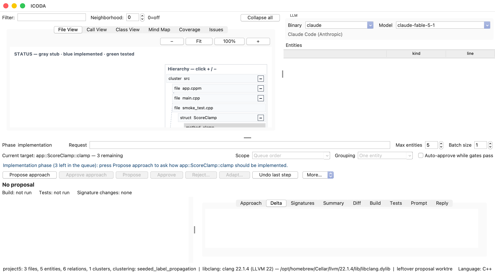
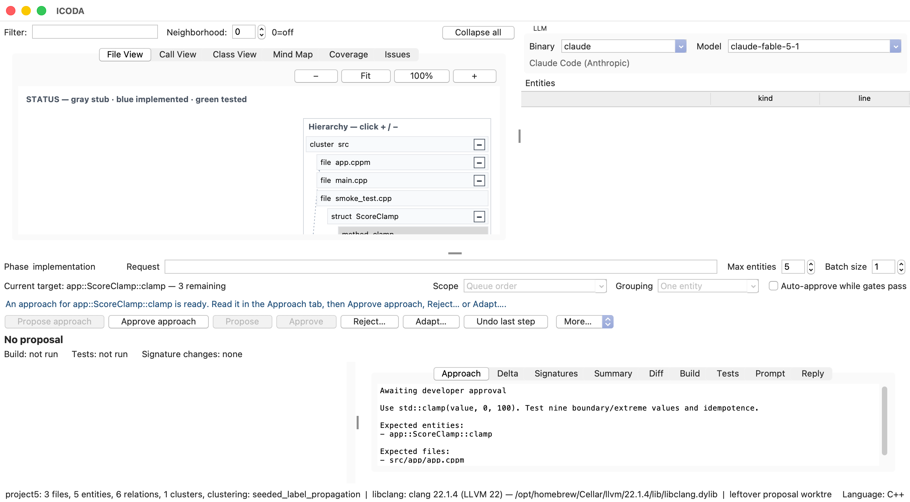
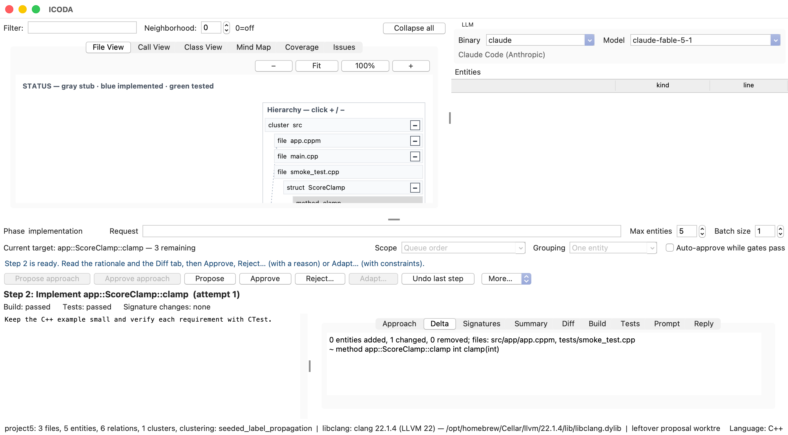
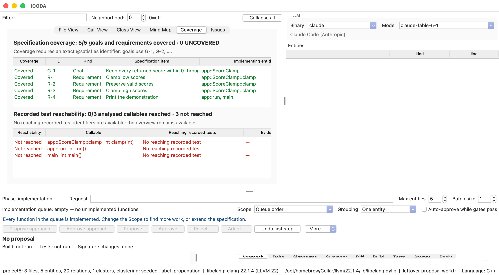

# Full C++ tutorial: Score Clamp from specification to a running program

Build a small C++23 application with ICODA, starting from an empty folder and finishing with tested code, a
working executable, and recorded Git history. The program clamps integer scores to the inclusive range 0 to 100.
For inputs -5, 42, and 120, it prints:

```text
scores: 0 42 100
```

The example uses C++20 modules, CMake, Ninja, and CTest, following ICODA's generated C++ skeleton. It requires no
third-party C++ library. Allow 30 to 60 minutes for a first run; provider calls and compilation determine the
actual time. Python runs ICODA itself; the application and every test in this tutorial are C++.

The complete reference project is in `docs/examples/score-clamp/`. Section 9 reproduces all three source files.
Follow the new-project workflow first; use the reference to review the provider's result or recover from an
overcomplicated proposal. Generated titles and step numbers can vary after retries. Check the named entities,
actual source changes, and gate results instead of expecting identical prose.

## 1. Prepare ICODA and the C++ toolchain

Install Git, Python 3.10 or later with Tkinter, CMake 3.28 or later, Ninja, and a C++23 compiler with C++20 module
dependency scanning. A matching LLVM installation provides `clang++`, `clang-scan-deps`, and libclang. On macOS,
use Homebrew LLVM; Apple's Clang does not provide the module-scanning integration used here.

From the repository's `icoda` directory, prepare the pinned ICODA environment:

```bash
python3 -m venv .icoda-venv
.icoda-venv/bin/python -m pip install -e '.[dev]' -c constraints.txt
```

On Windows Command Prompt:

```bat
py -3.12 -m venv .icoda-venv
.icoda-venv\Scripts\python.exe -m pip install -e ".[dev]" -c constraints.txt
```

The launchers check this environment; they do not install packages. Authenticate one enabled provider before
launching ICODA. Use its installed executable in the **Binary** field and select a **Model**; the tutorial does
not require a particular model ID.

For terminal builds on macOS, select Homebrew LLVM before the first configure:

```bash
export CC="$(brew --prefix llvm)/bin/clang"
export CXX="$(brew --prefix llvm)/bin/clang++"
cmake --version
ninja --version
"$CXX" --version
```

On Linux, set `CC` and `CXX` to matching Clang executables if needed. On Windows, use an LLVM/MSVC developer
command prompt with Ninja and the Windows SDK available. ICODA also selects a compiler for its build gates.
Changing compilers after configuring requires a fresh build directory.

## 2. Create an empty project

From the repository's `icoda` directory on macOS or Linux:

```bash
project_dir="$(mktemp -d /tmp/icoda-score-clamp.XXXXXX)"
printf '%s\n' "$project_dir"
./icoda.bash
```

On Windows, create an empty folder such as `C:\work\icoda-score-clamp`, then launch `icoda.cmd`. Keep the folder
path for the independent build later.

1. Set **Binary** and **Model** in the LLM panel.
2. Choose **File > New Project...** and select the empty folder.
3. The Specification window opens. Keep **Auto-approve while gates pass** off throughout this tutorial.

## 3. Enter a small, testable specification

On **Overview**, enter:

- Title: `ScoreClamp`.
- Description: `A C++ console example that clamps integer scores to 0 through 100 and demonstrates three inputs.`

On **Scope**, use one item per line:

- Goals: `Keep every returned score within 0 through 100.`
- Not in scope: `Interactive input, files, networking, floating-point scores, and configuration.`
- Not allowed: `Third-party runtime or test libraries; platform-specific APIs.`
- Done when: `The boundary and extreme-value tests pass, the program prints scores: 0 42 100, and the implementation queue is empty.`

On **Use cases**, enter each record and press **Add**:

1. `Clamp a score`: `A caller supplies any int and receives its nearest value in the inclusive interval 0 to 100.`
2. `Run the demonstration`: `A user runs the program and sees the clamped values for -5, 42, and 120 on one line.`

The editor assigns `UC-1` and `UC-2`. On **Requirements**, add these records in order, all with priority `must`.
Put the exact behavior in **Details**:

1. R-1, title `Clamp low scores`, use case UC-1: every negative int returns 0, including the minimum int.
2. R-2, title `Preserve valid scores`, use case UC-1: values from 0 through 100 are unchanged; clamping twice gives the same result.
3. R-3, title `Clamp high scores`, use case UC-1: values above 100 return 100, including the maximum int.
4. R-4, title `Print the demonstration`, use case UC-2: print `scores: 0 42 100` followed by a newline and exit with status 0.

On **Decisions**, add:

1. `Use the standard library`. Why: `std::clamp expresses the range rule without overflow-prone arithmetic.`
2. `Use one application module`. Why: `Keep the example in module app with a thin executable entry point.`
3. `Use standalone C++ tests through CTest`. Why: `A nonzero test exit status signals failure without downloading a test library.`

On **Code profile**, use these values:

| Field | Value |
|---|---|
| Language / Standard | C++ / 23 |
| C++20 modules | Enabled |
| Test framework | CTest with standalone C++ test executables |
| Test runner | ctest --preset debug |
| Test files | tests/<subsystem>_test.cpp |
| Source extension | .cppm |
| Module / Class / Function naming | snake_case / PascalCase / snake_case |
| Libraries | C++ standard library only; no external dependencies |
| Max function lines / Hard max function lines | 30 / 50 |

Press **Validate**, resolve reported issues, then **Save**. Accept **Build it now?**. A new C++ skeleton contains
11 generated files. After a successful build and analysis, the phase is `architecture`.

## 4. Inspect the skeleton and establish a baseline

The important generated files are:

- `CMakeLists.txt`: module library, application executable, and CTest smoke-test target.
- `CMakePresets.json`: debug/release configure, build, and test presets.
- `src/app/app.cppm`: exported module app, initially containing app::run().
- `src/main.cpp`: program entry point that calls app::run().
- `tests/smoke_test.cpp`: separate C++ test executable registered as the smoke CTest.
- `build.sh` and `build.cmd`: platform-aware configure/build/test helpers.

The generated `app::run()` returns 0 but does not print the demonstration. A passing initial smoke test checks
only this skeleton; it does not establish R-1 through R-4.

In a second terminal, change to the folder selected in section 2 and run:

```bash
cd /absolute/path/to/your/icoda-score-clamp-project
./build.sh debug
```

On Windows, use `cd /d C:\work\icoda-score-clamp`, then `build.cmd debug`. Expect a successful build and the
single `smoke` test passing. If the build fails, fix the toolchain before proposing code. Verify that
`build/debug/compile_commands.json` exists, then use **Project > Build** or **File > Reload**.

Open **File View** to find the module, main file, and test file. **Coverage** should not claim that the
specification is complete yet.

## 5. Propose and approve the architecture

Set **Max entities** to `5`. Enter this request:

```text
In src/app/app.cppm add app::ScoreClamp with one public static
int clamp(int value) method. Its body must remain a stub returning 0.
Add Doxygen @satisfies tags for R-1, R-2, and R-3.
Keep app::run(), main(), and the smoke test behavior unchanged.
Do not implement clamping, print output, or add dependencies yet.
```

1. Press **Propose**. ICODA prepares step 0 and creates an isolated proposal worktree.
2. Read **Delta**. Expect the ScoreClamp type and clamp method without unrelated public entities.
3. Read **Diff**. The method is a stub; existing application behavior is unchanged.
4. Require **Build: passed** and **Tests: passed**.
5. Press **Approve**. ICODA repeats the gates in the project, records the change, and commits it.

Use **Reject...** or **Adapt...** if the provider adds extra features. Do not add final behavior assertions in this
architecture step: those assertions would correctly fail against the temporary stub.

Press **Approve architecture** and confirm. The phase becomes `implementation`. Keep Scope `Queue order`,
Batch size `1`, and Grouping `One entity`. The generated entry points are recorded as architecture callables too:
expect to review `app::ScoreClamp::clamp`, `app::run`, and the application `main`, not only the new method.
Test-file callables are excluded from the implementation queue.



The red rectangles mark the implementation phase, queue target, and controls used for the next round.

## 6. Implement the clamp method in two rounds

If another target is current, right-click `app::ScoreClamp::clamp` and choose **Implement this function**.
Keep the remaining callables for their own review. Enter this request and press **Propose approach**:

```text
Implement only app::ScoreClamp::clamp using std::clamp(value, 0, 100).
Add <algorithm> in the global module fragment before export module app.
Test minimum int, -1, 0, 1, 42, 99, 100, 101, and maximum int.
Also test that clamping an already-clamped result changes nothing.
Use the smoke CTest with a nonzero return on failure.
Keep app::run() and the application main() unchanged.
```

Read **Approach**. The plan should name `src/app/app.cppm` and `tests/smoke_test.cpp`. It should not add interactive
input, dependencies, or signature changes. Press **Approve approach**, then **Propose** for the code round.



Inspect the code and tests. Section 9 contains the complete reference. All nine inputs must have independent
expected values; computing an expected value by calling the same method would hide bugs. The extreme inputs
also guard against overflow-prone range adjustments.

The method should reduce to:

```cpp
static int clamp(int value) {
    return std::clamp(value, 0, 100);
}
```

Require both passing gates, then press **Approve**. The method advances out of the queue. This request does not
change its signature. If **Confirm signatures** appears, inspect the old and new declarations before accepting.



## 7. Complete the console program and its output test

Return Scope to `Queue order` if an override selected `Single entity`. For target `app::run`, propose and approve
this approach, then propose its code:

```text
Implement app::run() to print exactly scores: 0 42 100 and a newline,
using ScoreClamp::clamp(-5), ScoreClamp::clamp(42), and ScoreClamp::clamp(120).
Return 0. Include <iostream> in the global module fragment.
Keep all clamp tests. Add a CTest named demo that runs the ScoreClamp
executable and checks its output. Do not add input parsing.
```

Review the body in section 9 and this addition to the generated `CMakeLists.txt`:

```cmake
add_test(NAME demo COMMAND ScoreClamp)
set_tests_properties(demo PROPERTIES
    PASS_REGULAR_EXPRESSION "scores: 0 42 100"
)
```

The `smoke` test verifies values and the application service; `demo` exercises the executable. The CTest output
expression checks that the expected text occurs. Also compare the complete output in section 10 to catch extra
output. Approve only after both gates pass.

When the queue reaches the application `main`, complete its approach/code round too. Request a thin entry point
that calls `app::run()` and converts its result to process exit status 0 or 1, as shown in section 9. Retain the
`demo` test. This small step explicitly closes the entry point's architecture status.

Repeat the two rounds for any additional callable introduced by the provider. A literal `return 0;` is not proof
that an architecture callable has completed implementation review. Finish when the queue says
`Implementation queue: empty - no unimplemented functions` (the GUI may use an em dash).

## 8. Review the final project in ICODA

1. **File View**: find the module, main, and C++ test sources.
2. **Class View**: inspect ScoreClamp and its static clamp method.
3. **Call View**: follow main to app::run and the clamp method.
4. **Coverage**: check exact `@satisfies` links for R-1 through R-4; tests alone do not imply traceability.
5. **Build** and **Tests**: inspect the evidence recorded for each approved implementation step.
6. **Issues**: review code-profile findings even when mandatory gates pass.



The recorded test reachability index projects successful recorded test identifiers through analysed call edges. It does
not measure executed lines or branches and does not prove assertion quality. The explicit boundary cases and
output check provide behavioral evidence for this example.

In the reference capture, all five specification items (one goal and four requirements) are linked, while recorded
test reachability reports 0 of 3 callables. The standalone CTest run did not supply reaching identifiers to that
index. This is an evidence-index limitation: inspect the successful smoke/demo output and their C++ assertions
directly. Do not describe the red reachability count as either failing CTests or complete runtime coverage.

## 9. Complete reference source

These are the final versions of all three C++ source files. The generated project supplies the CMake targets;
section 7 adds the `demo` test. A runnable copy including CMake files is in `docs/examples/score-clamp/`.

### Application module: src/app/app.cppm

Keep standard-library includes in the global module fragment, before `export module app;`.

```cpp
module;
#include <algorithm>
#include <iostream>
export module app;

/// @brief Operations for the Score Clamp example.
export namespace app {

/// @brief Keeps an integer score in the inclusive range 0 to 100.
/// @satisfies G-1
struct ScoreClamp {
    /// @brief Clamp a score without overflow or changing in-range values.
    /// @satisfies R-1
    /// @satisfies R-2
    /// @satisfies R-3
    static int clamp(int value) {
        return std::clamp(value, 0, 100);
    }
};

/// @brief Print three representative scores and return success.
/// @satisfies R-4
int run() {
    std::cout << "scores: " << ScoreClamp::clamp(-5) << ' '
              << ScoreClamp::clamp(42) << ' '
              << ScoreClamp::clamp(120) << '\n';
    return 0;
}

}  // namespace app
```

### Executable entry point: src/main.cpp

```cpp
/// @file main.cpp
/// @brief Entry point for the Score Clamp demonstration.
import app;

/// @brief Return a conventional process success or failure status.
/// @satisfies R-4
int main() {
    return app::run() == 0 ? 0 : 1;
}
```

### Boundary tests: tests/smoke_test.cpp

Explicit exit codes keep the tests effective even when assertions are disabled in a release build.

```cpp
#include <array>
#include <iostream>
#include <limits>
#include <utility>
import app;

/// @brief Check boundaries, extreme integers, and idempotence.
/// @satisfies R-1
/// @satisfies R-2
/// @satisfies R-3
/// @satisfies R-4
int main() {
    const std::array<std::pair<int, int>, 9> cases{{
        {std::numeric_limits<int>::min(), 0}, {-1, 0},
        {0, 0}, {1, 1}, {42, 42}, {99, 99},
        {100, 100}, {101, 100},
        {std::numeric_limits<int>::max(), 100},
    }};
    for (const auto& [input, expected] : cases) {
        const int actual = app::ScoreClamp::clamp(input);
        if (actual != expected ||
            app::ScoreClamp::clamp(actual) != actual) {
            std::cerr << "Unexpected result for " << input << '\n';
            return 1;
        }
    }
    return app::run();
}
```

## 10. Build, test, run, and inspect the history independently

From your project root, with the compiler selected as in section 1:

```bash
cmake --preset debug
cmake --build --preset debug
ctest --preset debug
./bin/Debug/ScoreClamp
git log --oneline
git status --short
```

On Windows, the executable is `bin\Debug\ScoreClamp.exe`. The generated helper is also available:
`./build.sh debug` or `build.cmd debug` configures, builds, and runs CTest.

For the reference result, CTest runs `smoke` and `demo` and reports:

```text
100% tests passed, 0 tests failed out of 2
```

The program prints exactly `scores: 0 42 100` plus a newline and returns 0. Check that Git contains the skeleton,
architecture, and implementation commits. ICODA metadata can have pending state changes; ordinary C++ source
files should match the last approved step.

To try the supplied reference without replaying the workflow, copy `docs/examples/score-clamp/` into an empty
folder outside the ICODA checkout and run the same commands there. Open that copy with **File > Open Project...**
if desired. An existing CMake project opens as an existing implementation project; it does not recreate the
new-project decision history.

## 11. Recover from a failed or oversized proposal

If **Build** fails, inspect the first meaningful compiler error. Missing `clang-scan-deps` or unsupported modules
usually indicates a mismatched toolchain. A missing `std::clamp` declaration usually means `<algorithm>` was omitted
or placed in the wrong part of the module.

If **Tests** fail, retain the failing input and expected value in an **Adapt...** instruction:

```text
The input 101 must produce 100, but the candidate returned 101.
Fix only the clamp implementation. Keep the nine boundary cases
and idempotence check, and rerun smoke and demo.
```

Use **Reject...** for a proposal going in the wrong direction. For a small manual correction, open the proposal
worktree, edit the candidate, and use **Rebuild** before reviewing it again. If ordinary project files were edited,
use **Commit manual edits** before starting another proposal.

ICODA enforces the hard 50-line function limit during proposal checks and again before approval. Split a long
function into meaningful helpers; do not remove tests or compress statements to bypass the limit. A provider
reply exceeding `MAX_RESPONSE_BYTES` or violating the path/schema contract is refused before application; this
is separate from a compiler or CTest failure.

Completion means all four requirements have been reviewed, the expected output and both tests pass, the
implementation queue is empty, and the accepted source is recorded in Git.
